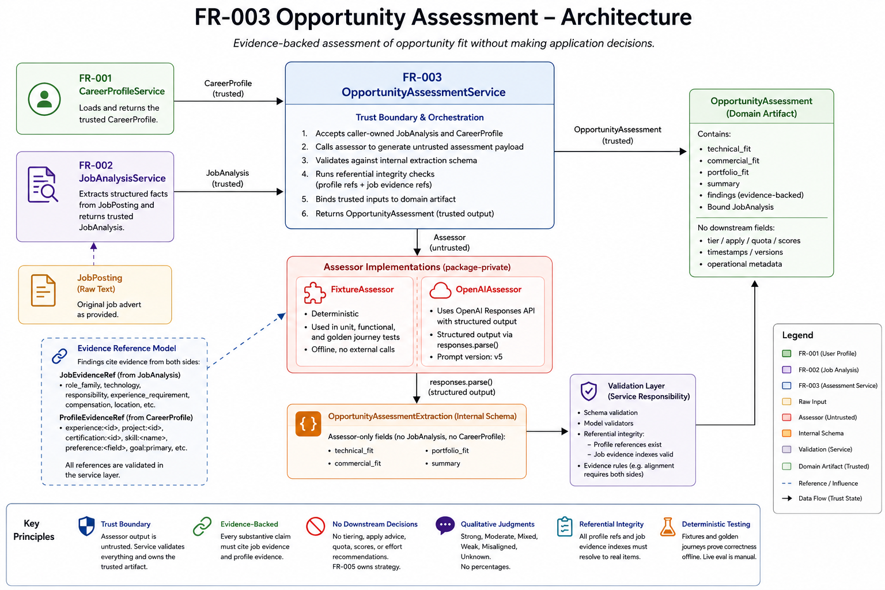

# Implementation Notes

Durable engineering notes for the implemented system. This document records data
provenance, intentional deviations from approved plans, and a backlog of known
improvements. It complements — and does not override — the authoritative documents in
[00_repository_guide.md](00_repository_guide.md).

---

## FR-003 Opportunity Assessment — Architecture and Verification Overview



*FR-003 architecture and verification overview — service flow, trust boundaries,
assessor implementations, evidence model, design principles, and closeout guidance.*

### Purpose

FR-003 compares a trusted `CareerProfile` (FR-001) with a trusted `JobAnalysis` (FR-002)
and produces an evidence-backed `OpportunityAssessment`. It assesses fit across Technical,
Commercial, and Portfolio dimensions. It does **not** decide whether the user should apply,
assign an application tier, or allocate JobSeeker effort — those concerns belong to
downstream strategy (especially FR-005).

### Inputs and output

| Direction | Artifact |
|-----------|----------|
| Input | `CareerProfile` from `CareerProfileService` |
| Input | `JobAnalysis` from `JobAnalysisService` |
| Output | `OpportunityAssessment` with `technical_fit`, `commercial_fit`, `portfolio_fit`, `summary`, evidence-backed findings, and the caller-owned `JobAnalysis` |

### Service composition

```
CareerProfileService
        ↓
CareerProfile

JobPosting
        ↓
JobAnalysisService
        ↓
JobAnalysis

JobAnalysis + CareerProfile
        ↓
OpportunityAssessmentService
        ↓
OpportunityAssessment
```

### Trust boundary

`OpportunityAssessmentService` is the public trust boundary (mirrors FR-002):

1. Callers supply validated `JobAnalysis` and `CareerProfile` plus an explicit assessor.
2. The assessor returns an untrusted `OpportunityAssessmentPayload` that must **not**
   include `job_analysis`, `profile`, or `career_profile`.
3. The service rejects embedded caller-owned inputs, binds the original `JobAnalysis`,
   validates schema, and checks referential integrity of job and profile evidence refs.
4. Invalid references are rejected as `OpportunityAssessmentValidationError`.
5. The LLM never owns the final trusted domain artifact.

There is **no silent production default assessor** — callers must inject one.

### Assessor implementations

| Assessor | Role |
|----------|------|
| **`FixtureAssessor`** | Deterministic offline scaffolding. Matched by shared FR-002 fixture markers in `job_analysis.posting.raw_text`. Used in unit, functional, and golden journey tests. Never a public default. |
| **`OpenAIAssessor`** | Package-private live path via OpenAI Responses API (`responses.parse`) into internal `OpportunityAssessmentExtraction`. Prompt version **v11**. Default model `gpt-4o-mini`. Client injectable for offline tests. Not exported from `career_intelligence.opportunity_assessment`. |

### Evidence model

- **`JobEvidenceRef`** cites facts from the bound `JobAnalysis` (`source`, optional
  `item_index`, optional excerpt).
- **`ProfileEvidenceRef`** cites facts from the bound `CareerProfile` using
  `namespace:id` refs (e.g. `skill:Python`, `project:governance-document-rag`,
  `preference:remote`).
- Alignments, partial alignments, transferable alignments, and conflicts require
  evidence from **both** sides.
- Gaps require at least one job evidence ref; profile evidence may be empty.
- List sources (`technology`, `responsibility`, `experience_requirement`) require a
  valid `item_index`. Scalar sources (`role_family`, `seniority`, `compensation`,
  `location`, `work_arrangement`, `employment`) must omit `item_index`.

### Qualitative judgments

Permitted dimension judgments: `strong`, `moderate`, `mixed`, `weak`, `misaligned`,
`unknown`. FR-003 deliberately avoids numerical fit percentages and interview
probabilities.

### Experience honesty

Profile experience kinds remain distinct:

- `employment`
- `independent_engineering`
- `professional_development`
- portfolio / project evidence

Independent engineering and portfolio projects may demonstrate capability via
`partial_alignment` or `transferable_alignment`. They must **not** be described as
commercial AI employment or paid commercial AI tenure unless an employment entry
supports that claim.

### Scope boundary — not produced by FR-003

Apply, Skip, Defer, application tiers, effort recommendations, JobSeeker quota logic,
`SearchOperatingContext`, interview probabilities, or percentage fit scores. Deferred to
FR-005 and later strategy stages.

### Approved design decisions

- `OpportunityAssessment` is a pure business-domain artifact (no
  `profile_schema_version`, no operational metadata).
- JobSeeker quota and `SearchOperatingContext` remain FR-005 concerns.
- Candidate working rights are never inferred from location, citizenship, or history.
- `salary_min = null` means no candidate salary threshold — do not invent conflict from
  currency alone.
- Live OpenAI evaluation closed at **PARTIAL PASS**; offline architecture and golden
  journeys remain authoritative for CI.

### Implementation status

Delivered:

- Domain models and validators
- `OpportunityAssessmentService` + assessor protocol
- Deterministic assessment fixtures keyed by shared FR-002 markers
- Functional acceptance suite (`tests/functional/test_fr003_acceptance.py`)
- `OpenAIAssessor` with structured output and prompt versioning through **v11**
- Live manual evaluation ([eval/fr003_openai_manual_eval.md](eval/fr003_openai_manual_eval.md))
- Cross-stage golden journeys (`tests/golden/test_opportunity_assessment_user_journey.py`)
- FR-001 → FR-002 → FR-003 offline integration

### Testing and evaluation evidence

Automated tests are offline only. Live API calls use
`tools/manual_eval_openai_assessor.py` and are not part of CI.

| Suite | Result (Phase H verification) |
|-------|-------------------------------|
| Golden journey | **8 passed** |
| FR-003 unit + functional + golden | **94 passed** |
| Full suite | **260 passed** |

### Known limitations (accepted at closeout)

1. **`salary_min=null`** — live model may occasionally describe salary friction with no
   candidate threshold.
2. **Sparse-specification variance** — thin adverts can yield run-to-run variation or
   incomplete evidence.
3. **Scalar `item_index`** — live model may attach an unnecessary `item_index` to scalar
   job evidence (schema allows; prompt discourages).
4. **JobAnalysis dependency** — assessment quality partly tracks upstream FR-002 stability.
5. **Live nondeterminism** — manual evaluation only; not suitable for deterministic CI.

Validation catches structural failures (empty evidence, bad refs, assumption misuse)
where possible. These limitations do not invalidate the offline architecture. Revisit
through observed production evidence rather than speculative prompt churn.

### Prompt evolution (v1 → v11)

| Version | Justifying live failure |
|---------|-------------------------|
| v1 | Initial instructions |
| v2 | Bare profile refs without `namespace:id` |
| v3 | Empty `job_evidence`; `assumption` field misuse |
| v4 | Persistent empty evidence — cite-as JSON in input catalogue |
| v5 | Portfolio-only findings; scalar `item_index` discipline |
| v6 | Bare profile refs recurred (`Python`, project/experience ids, `salary_min`) because `<CareerProfile>` JSON exposed copyable bare identifiers; assessor input now catalogues complete refs only and rewrites profile pointers as `ref=` |
| v7 | `partial_alignment` / `transferable_alignment` with `profile_evidence=[]` on hybrid AI Product Manager roles; per-kind evidence contract + `<ProfileEvidenceCiteGuide>` |
| v8 | Non-assumption findings populated `assumption` text (Kogan Senior AI Engineer); `<FindingFieldGuide>` + explicit assume-only-when-kind rule |
| v9 | Job 009 Forever New: `commercial_fit=strong` despite material production LLM/agent gap; mis-grounded retail alignment via nbn; judgment must reflect material gaps; industry evidence must match |
| v10 | Job 010: catalogue experience ref emitted with trailing `.` (`chase-risk-compliance-ai-engineer.`); exact-token copy rule |
| v11 | Job 012: `portfolio_fit` alignment with `job_evidence=[]`; dual-evidence portfolio example + hard rule restated |

Current: `ASSESSMENT_PROMPT_VERSION = "v11"`.

### Fixture marker ownership

Shared markers such as `[CIC-FIXTURE:no-technologies]` and
`[CIC-FIXTURE:working-rights]` live in `job_analysis.fixtures`. Assessment payloads live
in `opportunity_assessment.fixtures` and key off the same markers. Fixture implementations
are not public exports.

---

## FR-002 Job Analysis — Implementation Notes

### Architecture

`JobAnalysisService` is the public trust boundary. Callers supply a validated
`JobPosting` and an explicit extractor. The extractor returns an untrusted
`JobAnalysisPayload` that must **not** include `posting`. The service rejects
embedded postings, binds the caller-supplied `JobPosting`, and validates a
trusted `JobAnalysis`.

```
Caller-owned JobPosting
        ↓
JobAnalysisService
        ↓
JobExtractor
        ↓
JobAnalysisPayload (untrusted)
        ↓
Service rejects embedded posting
        ↓
Service binds original JobPosting
        ↓
JobAnalysis.model_validate(...)
        ↓
Trusted JobAnalysis
```

### Extractors

- **`FixtureExtractor`** — deterministic offline scaffolding for tests. Matched by
  fixture markers in `raw_text`. Never a public default; callers must pass it
  explicitly.
- **`OpenAIJobExtractor`** — production-oriented extractor using the official OpenAI
  Python SDK Responses API (`client.responses.parse`) with structured output
  (`text_format=JobAnalysisExtraction`). Requires `openai>=1.66.0` (first release
  shipping `/v1/responses` and `responses.parse`). Default model: `gpt-4o-mini`
  (current default only). Configuration is limited to API key (SDK `OPENAI_API_KEY`
  or constructor override), model, and timeout. An OpenAI client may be injected for
  offline tests.
- **Complete posting input** — the extractor formats trusted `JobPosting` metadata as
  tagged sections (`JobTitle`, `Company`, `SourceURL`, `JobDescription`) so the model
  sees provenance, not only the description body. Titles often carry seniority that the
  body never repeats (e.g. "Principal AI Engineer"); analysing the complete posting
  prevents under-classified seniority. Location is not a `JobPosting` field today and is
  still extracted from the description into `LocationInfo`. `SourceURL` is provenance
  only. Responsibilities and technologies remain body-led. Trust boundary unchanged:
  caller-owned posting → extractor payload without `posting` → service bind/validate.

### JobAnalysisExtraction

Internal Pydantic model listing exactly the fields an extractor may produce
(all `JobAnalysis` fields except `posting`). Nested domain types are reused; the
model is checked in (not created with `create_model` or JSON Schema surgery). It
is not exported from `career_intelligence.job_analysis`. A unit parity test locks
field-set equality against `JobAnalysis` minus `posting`.

### Prompt

`extraction_prompt.py` holds `EXTRACTION_PROMPT_VERSION` and
`EXTRACTION_INSTRUCTIONS_V1` (constant name retained across versions). Instructions
forbid candidate comparison, recommendations, invention of missing facts, and emission
of `posting`.

#### Prompt evolution (why, not only what)

Live evaluation — not offline fixtures alone — forced successive prompt hardening.
Domain validators stayed strict; prompts had to teach the model the same discipline.
Full evaluation narrative:
[eval/fr002_openai_manual_eval.md](eval/fr002_openai_manual_eval.md).

| Version | Intent | Outcome |
|---------|--------|---------|
| **v3** | Tagged complete posting (`JobTitle`, `Company`, `SourceURL`, `JobDescription`); prefer clear title seniority with `"Job title"` evidence | Fixed body-only under-classification (e.g. Principal only in title) |
| **v4** | Strict employment non-inference: set `working_hours` / `engagement_type` only from explicit wording; otherwise unspecified | Fixed invented full-time/permanent; **regressed** global evidence — known claims emitted `evidence=[]` |
| **v5** | Compact **global** evidence rule near the top (every known claim needs an excerpt); keep employment non-inference; drop “empty evidence” negative heading that generalised badly | Restored evidence discipline without weakening employment rules |
| **v6** | De-prioritise SEEK/job-board chrome; split grouped technologies; extract multiple employer-authored responsibilities; retain required/preferred/unspecified | Addresses manual-validation under-extraction and chrome contamination |
| **v7** | Hybrid role-family guidance; prefer dominant profession over supporting AI/automation tech; add `network_engineering`; reinforce evidence for known families including `other` | Fixes Capgemini Network Engineer Automation & AI empty-evidence `other` failure |
| **v8** | `posting_identity` (title/company + evidence) extracted when present; service binds grounded values into missing `JobPosting` fields (M4a) | Blank title/company on persist/list/compare when CLI provenance omitted |

**Why prompt engineering was required:** OpenAI strict structured output requires the
`evidence` field but allows empty arrays. Validators catch empty evidence after the
fact. The model follows the loudest recent instructions — an employment-centric
“leave evidence=[] when unspecified” pattern generalised to technologies and
responsibilities. A short global evidence rule must stay prominent so field-specific
rules cannot displace it.

### Testing

All automated tests run offline. OpenAI coverage injects a tiny fake client with a
`responses.parse` method — no network, no API credits, no deep SDK mocks. Functional
tests cover both `FixtureExtractor` and `OpenAIJobExtractor` through
`JobAnalysisService`.

**Regression approach:** live failures become offline fixtures through the fake
client — title-only Principal seniority, employment non-inference (Software Engineer
(AI) / Principal), known claims with required evidence, and empty-evidence payloads
that must still raise `JobAnalysisValidationError`. Manual live checks remain in
[eval/fr002_openai_manual_eval.md](eval/fr002_openai_manual_eval.md).

---

## FR-001 Career Profile — Data Provenance

Every value in `data/career_profile.yaml` falls into one of three categories. Values that are
assumed/inferred are marked `OWNER-CONFIRM` in the profile until the owner confirms or corrects
them, because they influence real assessments (notably FR-003 Commercial Fit).

**Status: all flagged values were confirmed by the owner on 2026-07-19.** The Chase R&D start
date was corrected from the inferred 2023-11 to the owner-provided **2025-12**; goals,
locations, full-time employment, flexible remote arrangement, AUD currency with no salary
minimum, and the must-haves were confirmed as recorded.

### Evidence strength (capability demonstration)

Skills remain truthful claims. Downstream planners may distinguish *how* a skill is
demonstrated via `SkillEvidenceRef.kind` (or legacy `Skill.evidence` resolved against
experience/project/certification ids). Ordering is explainable, not a weighted score:
employment → independent engineering → portfolio project → certification → professional
development → coursework → unspecified. See
[docs/eval/career_profile_evidence_model_refinement.md](eval/career_profile_evidence_model_refinement.md).

### Confirmed from the Master CV

- Identity: full name, target role (AI Engineer), professional summary.
- Experience: nbn Australia — Data Engineer, Mar 2020 to Oct 2023 (organisation, title, dates,
  highlights, technologies). Classified `kind: employment`.
- Experience: Chase Risk & Compliance — AI Engineer, Independent Research & Development
  (organisation, title, highlights, technologies). Start date is inferred — see below.
  Classified `kind: independent_engineering`: an independent AI Engineering R&D and portfolio
  brand, not paid employment, consulting, or commercial delivery.
- Projects: Operational Intelligence Copilot, Governance-Aware Document Intelligence RAG,
  Payroll Diagnostics Engine, Public Holiday Entitlements Application — names, summaries,
  demonstrated capabilities, technologies, outcomes.
- Technical, domain, and soft skills, each traceable to a CV experience, project, or listed
  professional-development item.
- Certification: AWS Certified Developer - Associate.
- Location: Melbourne, VIC.

### Confirmed from project documentation

- Goals (`primary`, `secondary`, `horizon_notes`) are drawn from the product vision and
  roadmap (Horizon 1). They are consistent with the CV's direction but are the owner's
  objectives and still require owner endorsement.

### Assumed / inferred (owner-confirmed 2026-07-19)

| Value | Original inference | Outcome |
|-------|--------------------|---------|
| Chase R&D `start_date` | The CV states no date; inferred as 2023-11 (month after the nbn role ended). | **Corrected by owner to 2025-12.** |
| `preferences.locations` includes `Remote Australia` | Only Melbourne is on the CV; remote-Australia added as a plausible search scope. | Confirmed. |
| `preferences.employment_types: [full_time]` | Not stated on the CV. | Confirmed — full-time only. |
| `preferences.remote: flexible` | Not stated on the CV. | Confirmed. |
| `preferences.salary_currency: AUD` | Inferred from Australian location. `salary_min` left null. | Confirmed — no salary minimum. |
| `preferences.must_haves` | Inferred from the CV's stated career direction, not an explicit preference. | Confirmed; no deal-breakers added. |

Skill categorisation (technical / domain / soft) and the decision to record "professional
development" items (LangChain/LLM, Microsoft Fabric, Databricks, Snowflake, dbt, Azure Data
Factory) as skills rather than certifications are implementer judgments consistent with the
CV's own labelling; they are not value inventions.

### Career-history refinement (owner-directed, 2026-07-19)

The experience facet was refined so entries are typed by
`kind: employment | independent_engineering | professional_development` and the employer-only
field `company` was renamed `organisation`. Owner-provided timeline:

- **nbn Australia** (Mar 2020 – Oct 2023) — `employment`.
- **Data Engineering Professional Development and Career Transition**
  (Oct 2023 – Jun 2025) — `professional_development`; began with a personal break, then
  structured upskilling across Microsoft Fabric, Databricks, Snowflake, dbt, and Azure Data
  Factory.
- **AI Engineering Professional Development and Portfolio Development**
  (Jul 2025 – Nov 2025) — `professional_development`; deliberate pivot to AI Engineering.
- **Chase Risk & Compliance** (Dec 2025 – present) — `independent_engineering`; independent
  AI Engineering R&D and portfolio brand. Not employment, clients, revenue, consulting, or
  commercial delivery.

Skill evidence previously recorded under the informal `professional-development:master-cv`
namespace now cites the relevant professional-development experience IDs. No new top-level
career-phase ontology, separate collections, or project attribution links were introduced.

Deliberately not modelled (present on the CV, out of scope for decision support): contact
details, citizenship, and portfolio/GitHub URLs. These become relevant only for the deferred
CV-generation requirements.

**Enrichment sprint (owner-confirmed, 2026-07-23).** General Assembly technologies gained
`NLP` and `Web Scraping` as course-only evidence on that experience entry; they are not
global Skills. Java, Ruby on Rails, and Gherkin remain historical experience technologies
only. Project and certification `url` fields stay null until the owner confirms per-project
canonical links (certification URLs explicitly deferred). Personal links for CV generation
belong on FR-006 `ContactDetails` (owner-confirmed values for callers: GitHub
`https://github.com/dcrops`, portfolio
`https://journey.chaseriskandcompliance.com.au/`, LinkedIn
`https://www.linkedin.com/in/david-cropper/`). See
[docs/eval/career_profile_enrichment_report.md](eval/career_profile_enrichment_report.md).

### Accuracy and provenance refinement (owner-supplied, 2026-07-19)

The Master CV starts the professional history at nbn Australia and understated total
commercial technology experience. The pre-nbn history below is **not on the Master CV**; it
was supplied directly by the owner in an interactive confirmation session on 2026-07-19:

- **Bakers Delight** — Test Analyst (Mar 2009 – Jun 2012), `employment`. Role-level
  responsibilities were not provided; highlights are intentionally empty (flagged
  `OWNER-CONFIRM` in the profile) rather than invented.
- **Console** — Test Analyst (Jun 2012 – Dec 2014), `employment`. Ruby on Rails automation
  scripts, Agile ceremonies, Gherkin/Cucumber user-story tests.
- **Bakers Delight** — Test Analyst (Jan 2015 – Oct 2018), `employment`. POS replacement
  across 750 bakeries in 4 countries; automation framework; Selenium WebDriver with Java;
  Maven and Jenkins; test environments.
- **AccessHQ** — Test Analyst (Oct 2018 – Jun 2019), `employment`. Consultant to Public
  Transport Victoria (PTV): Selenium and API test suites for Myki/PTV systems, mobile and
  functional testing with Jira. Recorded under the employer AccessHQ, not the client PTV.
- **Bakers Delight** — Test Analyst (Aug 2019 – Sep 2019), `employment`. Short return
  engagement; title assumed to match the earlier role (flagged `OWNER-CONFIRM`).
- **General Assembly** — Data Science Immersive (Sep 2019 – Dec 2019),
  `professional_development`. Course projects (job-listing web scraping with NLP/predictive
  modelling; real-estate price analysis) are attributed here, not to Bakers Delight.

The professional summary now distinguishes total commercial technology experience (since
2009), the 3.5 years of commercial Data Engineering experience, and independent AI
Engineering/portfolio development. It does not claim commercial AI Engineering employment.

**Certifications.** `Certification` gained a required `status: active | expired` and an
optional `expiry_date` (`YYYY-MM`) so credentials are represented truthfully. Owner-supplied
statuses (2026-07-19): Databricks Certified Data Engineer Associate — **expired** Jul 2026;
Databricks Certified Data Engineer Professional — active until Aug 2026; AWS Certified
Developer - Associate — active until Sep 2026. The two Databricks credential names are
owner-supplied; the CV lists Databricks only as professional development. Note: an earlier
owner instruction described both AWS and Databricks certifications as expired; the owner
superseded this during the confirmation session by choosing the recorded expiry dates, under
which only the Databricks Associate credential has expired as of Jul 2026.

**PyTest at nbn** is owner-confirmed genuine usage during nbn employment and is retained as
nbn evidence.

---

## Deviations from the Approved FR-001 Plan

Both deviations are intentional and preserve the plan's intent; neither changes an
architectural decision, so ADR-001 is unchanged.

1. **Preference validation.** The plan listed a model validator: "preferences must include at
   least one location or an explicit remote preference." This was implemented structurally
   instead — `Preferences.remote` is a required field with no default, so an explicit remote
   preference is always present. The standalone validator was therefore removed as redundant.

2. **Inferred employment date placement.** The plan did not specify where to record inferred
   values. The Chase R&D start-date inference was initially written as an experience
   `highlight`; it has been moved to a YAML `OWNER-CONFIRM` comment so that `highlights`
   contains only genuine achievements and does not feed a meta-note into downstream portfolio
   or fit analysis.

---

## Future Improvements (Backlog)

Known, accepted technical debt from the FR-001 engineering review. These are intentionally
deferred, not defects. Evaluate against the dual-value test before promoting any item.

- **De-duplicate validation translation.** The `pydantic.ValidationError` to
  `ProfileValidationError` conversion exists in both `storage/yaml_store.py` and
  `profile/service.py`. Extract a single shared helper.
- **De-duplicate date parsing.** The `YYYY-MM` `parse_month` validator is repeated in
  `ExperienceEntry` and `Certification`. Extract a shared reusable validator or annotated type.
- **Install-safe default profile path.** `DEFAULT_PROFILE_PATH` assumes the editable repo
  layout (`parents[3]/data/...`) and the `data/` directory is not packaged. Resolve via
  packaged resources or require `CIC_PROFILE_PATH` before any non-editable install.
- **Evidence resolution.** Skill/`demonstrates` `evidence` strings are free text and are not
  checked against real experience/project IDs. (The informal
  `professional-development:master-cv` namespace was retired in the career-history refinement;
  all skill evidence now cites `experience:` or `project:` IDs.) FR-003 validates
  `ProfileEvidenceRef` / `JobEvidenceRef` integrity at assessment time; skill-evidence
  strings inside the career profile itself remain unchecked.
- **Project attribution links.** Projects are not linked to the independent-engineering
  context that produced them. A `context_id` reference to an experience entry may aid
  explainability; deliberately excluded from the career-history refinement. FR-003 cites
  projects and experience kinds separately via evidence refs.
- **Profile load caching.** `get_section` and `summary` each re-read and re-parse the file.
  Acceptable for occasional interactive use; revisit if a downstream flow reads many sections
  per operation.
- **Typed section access.** `CareerProfileService.get_section` returns `Any`. Downstream
  consumers should prefer `load()` for full typing; consider typed accessors or overloads if a
  dynamic section API proves necessary.

---

## FR-004 Portfolio Matching — Architecture Notes

### Purpose

FR-004 ranks portfolio projects for a trusted `CareerProfile` and `JobAnalysis`, producing
a separate `PortfolioMatch` artifact. It answers which projects should lead, in what order,
and why. It does **not** assess overall portfolio fit, assign tiers, or recommend Apply/Skip.

### Sibling boundary with FR-003

| Concern | FR-003 Portfolio Fit | FR-004 Portfolio Match |
|---------|----------------------|------------------------|
| Question | Does the portfolio support the role? | Which projects should lead, and why? |
| Inputs | CareerProfile + JobAnalysis | CareerProfile + JobAnalysis |
| Dependency | None on Portfolio Match | None on OpportunityAssessment |
| Output facet | `portfolio_fit` dimension | Ranked `PortfolioMatch` artifact |

Do not modify, replace, or repurpose `OpportunityAssessment.portfolio_fit` for ranking.

### Inputs and output

| Direction | Artifact |
|-----------|----------|
| Input | `CareerProfile` from `CareerProfileService` |
| Input | `JobAnalysis` from `JobAnalysisService` |
| Output | `PortfolioMatch` with `ranked_projects`, `unranked_project_ids`, `summary`, `insufficient_evidence`, and the caller-owned `JobAnalysis` |

### Service composition

```
CareerProfileService → CareerProfile
JobAnalysisService   → JobAnalysis

CareerProfile + JobAnalysis
        ↓
PortfolioMatchingService
        ↓
PortfolioMatch
```

Opportunity Assessment is not on this path.

### Trust boundary

`PortfolioMatchingService` mirrors FR-002/FR-003:

1. Callers supply validated `JobAnalysis` and `CareerProfile` plus an explicit matcher.
2. The matcher returns an untrusted payload that must **not** include `job_analysis`,
   `profile`, or `career_profile`.
3. The service binds the original `JobAnalysis`, validates schema, and checks project
   coverage plus evidence-reference integrity.
4. There is **no silent production default matcher**.

### Matcher implementations

| Matcher | Role |
|---------|------|
| **`DeterministicMatcher`** | Production ranking path. Technology phrase matching and responsibility/demonstrates token overlap; ordered by required → preferred → demonstrates → responsibility → unspecified → stable `project_id`. Package-private; inject explicitly. |
| **`FixtureMatcher`** | Offline canned payloads keyed to shared FR-002 markers (plus `MARKER_PORTFOLIO_TIE`). Never a public default. |

### Ranking behaviour (deterministic)

- Match job technologies against project `technologies`, `demonstrates`, `summary`, `outcomes`.
- Match job responsibilities against project `demonstrates`, `summary`, `outcomes`, `technologies`.
- Emit explainable `RankingFactor` entries with job + `project:<id>` profile evidence.
- Zero-factor projects go to `unranked_project_ids`.
- Empty technologies and responsibilities → `insufficient_evidence=True`, all projects unranked.
- Equal primary keys share `tie_group`; display order uses stable `project_id` ascending.

No percentage scores, embeddings, or retrieval infrastructure.

### Known limitations

- Shared baseline technologies (e.g. Python across all projects) can produce honest ties when
  the job does not distinguish further stack evidence — accepted for non-target role families
  such as Data Engineer; do not invent distinguishing evidence.
- Token/phrase overlap is intentionally simple; an optional narrative layer may be considered
  later only if deterministic rationales prove too thin in live use.
- Fixture match payloads are aligned to the golden career profile project set.

---

## FR-005 Application Strategy — Architecture Notes

### Purpose

FR-005 produces an evidence-backed `ApplicationStrategy` from trusted
`CareerProfile`, `OpportunityAssessment`, and `PortfolioMatch` inputs. It answers how
to pursue the opportunity (posture), how much effort is justified (tier), what to do
next (advisory `next_actions`), and what could change the recommendation — without
autonomous apply/skip or content generation.

### Downstream consumption of siblings

```
CareerProfile + JobAnalysis
        ├─→ OpportunityAssessment (FR-003)
        └─→ PortfolioMatch (FR-004)
                  ↓
        ApplicationStrategyService
                  ↓
          ApplicationStrategy
```

Application Strategy does **not** redo job extraction, fit assessment, or portfolio
ranking. Portfolio emphasis copies Portfolio Match order (cap 3); it does not rerank.

### Trust boundary

`ApplicationStrategyService` mirrors FR-002–004:

1. Callers supply validated assessment, portfolio match, profile, and an explicit planner.
2. Optional `SearchOperatingContext` defaults to `volume_applications_enabled=False`.
3. Planner returns an untrusted payload that must **not** embed trusted inputs.
4. Service rejects mismatched OpportunityAssessment / PortfolioMatch posting identity,
   binds `job_analysis` from the assessment, validates schema and evidence refs.
5. There is **no silent production default planner**.

### Planner implementations

| Planner | Role |
|---------|------|
| **`DeterministicStrategyPlanner`** | Production recommendation path. Explicit rule-based policy over fit judgments, role family, preferences, Portfolio Match, and volume context. Package-private; inject explicitly. |
| **`FixtureStrategyPlanner`** | Offline canned payloads keyed to shared FR-002 markers (plus strategy-only markers). Never a public default. |

### Recommendation semantics

- **PursuitPosture** — primary recommendation
- **ApplicationTier** — Platinum / Gold / Silver / **Bronze** (effort only; Bronze ≠ never apply)
- **next_actions** — closed `consider_*` taxonomy; recommendations only
- Final apply / skip / defer — owner decision (FR-013)

### Seniority stretch policy

`DeterministicStrategyPlanner` treats explicit seniority mismatch for AI-target families
as a credible stretch, not automatic rejection:

- Inputs used: `JobAnalysis.seniority` and job leadership/executive language,
  Opportunity Assessment findings (commercial and technical), `CareerProfile.experience.kind`,
  and commercial fit judgment.
- Direct senior commercial AI evidence requires `employment` experience that is AI-related
  and shows senior ownership / leadership / production markers. Independent engineering
  does not satisfy that evidence bar.
- Cap triggers from material OA senior/leadership gap findings **or** JobAnalysis text
  signalling executive / commercial leadership expectations (not bare “Senior” title alone).
- Cap: `consider` / Silver / `acceptable_opportunity`; targeted effort when technical and
  portfolio fits are strong. Gold remains possible when matching commercial evidence exists.
- Not a title-only or employer-specific rule.

### Five-question standard

Answered via existing fields: `reasons`, `risks_or_gaps`, `next_actions`, evidence refs,
`manual_checks`, `assumptions` / `decision_blockers`.

### Known limitations (accepted at closeout)

1. Deterministic recommendation policy only — no mandatory OpenAI narrative synthesis.
2. No CV / cover-letter generation, outreach, or application submission.
3. No autonomous apply/skip commitment; `owner_review_required` is always true.
4. Traditional Data Engineer roles are not specially optimised for the AI search.
5. Fixture marker coverage is intentionally narrower than production-policy unit coverage;
   prefer DeterministicStrategyPlanner for product-behaviour assertions.
6. Soft location mismatch (e.g. Sydney hybrid vs Melbourne preference) can reduce an
   otherwise strong opportunity from prioritise/platinum to pursue/gold — intentional.
7. Location soft-matching normalizes punctuation, whitespace, parenthetical arrangement
   suffixes, and common Australian state aliases (`VIC`/`Victoria`). False conflicts
   between `Melbourne, VIC` and `Melbourne VIC (Hybrid)` were fixed after manual
   validation Job 001; genuine city mismatches still warn.

### Manual validation closeout (engineering reasoning)

Owner live validation of FR-001→FR-005 is **complete**. Notes:
[manual_validation/jobs/manual_validation_notes.md](../manual_validation/jobs/manual_validation_notes.md).

**Why Job 009 was an FR-003 issue, not an FR-005 issue.** Forever New produced
prioritise / platinum because Opportunity Assessment emitted `commercial_fit=strong`
(and related over-strong alignments) despite recording a material production LLM/agent
delivery gap and mis-grounding retail industry evidence on nbn employment. Application
Strategy mapped those judgments correctly under existing rules. Changing FR-005 thresholds
would have papered over bad upstream fit labels; fixing FR-003 calibration restored
consider / silver without redesigning strategy policy.

**Why FR-005 thresholds were intentionally not modified for Job 009.** Strategy policy
already encodes seniority stretch, AI-target families, and volume mode. The defect was
mis-calibrated commercial judgment and evidence grounding. Threshold churn would couple
strategy to every upstream wording variance and obscure the real contract: trust only
validated assessments.

**Why fail-closed validation is preferred over silent repair.** Malformed model output
(empty required evidence, trailing punctuation on catalogue refs, assumption field misuse,
mis-grounded industry/production alignments) must fail visibly. Silent insertion, stripping,
or downgrade of findings would hide generator regressions and teach the pipeline to accept
untrustworthy evidence. Prompt and cite-guide hardening reduce recurrence; validators stay
strict.

**Why independent engineering supports capability but not commercial employment.** Profile
`independent_engineering` / portfolio projects legitimately strengthen technical and
portfolio fit. They do not establish commercial production employment or senior commercial
AI ownership. Treating them as employment evidence produced Job 009’s over-strong commercial
judgment and would defeat the seniority-stretch employment bar in FR-005.

**Why validation now has a defined endpoint.** Jobs 001–013 covered strong AI matches,
senior stretch, hybrid/adjacent roles, and post-calibration regression (Pisell, Officeworks,
Maincode evidence-contract fix, pay.com.au). Remaining defects belong in normal regression
tests and prompt-version discipline — not an open-ended reopening of this validation phase.

### Owner manual validation runner

There was no existing full-pipeline CLI for FR-001→FR-005. Use:

`scripts/run_application_strategy_manual.py`

**Setup**

- Install the package in editable mode (`pip install -e ".[dev]"`).
- Live path requires `OPENAI_API_KEY` (OpenAI Python SDK).
- Profile defaults to `data/career_profile.yaml`, or override with `CIC_PROFILE_PATH` /
  `--profile-path`.

**Live real-job command**

```bash
python scripts/run_application_strategy_manual.py \
  --job-file path/to/real_job.txt \
  --title "AI Engineer" \
  --company "Example Co" \
  --source-url "https://example.com/jobs/123" \
  --output-json artifacts/manual_strategy.json
```

Optional volume mode:

```bash
python scripts/run_application_strategy_manual.py \
  --job-file path/to/real_job.txt \
  --volume-applications-enabled
```

Stdin is also supported when `--job-file` is omitted (non-interactive pipe only).

**Offline smoke (explicit fixtures only)**

Requires a job text containing a recognised `[CIC-FIXTURE:…]` marker. Write the file
as UTF-8 (on PowerShell prefer Python write, not `>` redirection which may emit UTF-16):

```bash
python -c "from pathlib import Path; from career_intelligence.job_analysis.fixtures import posting_applied_ai_engineer; Path('tmp_fixture_job.txt').write_text(posting_applied_ai_engineer().raw_text, encoding='utf-8')"

python scripts/run_application_strategy_manual.py \
  --job-file tmp_fixture_job.txt \
  --offline-fixtures \
  --title "Applied AI Engineer" \
  --company "Harbour Labs"
```

`--offline-fixtures` is never implied. Without it, a missing API key fails clearly.

**Component modes**

| Stage | Live default | Offline smoke |
|-------|--------------|---------------|
| Career profile | YAML via `CareerProfileService` | same |
| Job analysis | `OpenAIJobExtractor` | `FixtureExtractor` (explicit) |
| Opportunity assessment | `OpenAIAssessor` | `FixtureAssessor` (explicit) |
| Portfolio match | `DeterministicMatcher` | `DeterministicMatcher` |
| Application strategy | `DeterministicStrategyPlanner` | `DeterministicStrategyPlanner` |

`FixtureStrategyPlanner` is **not** used by this runner.

**FR-006 CV Generation (complete):** after strategy is trusted, use
`scripts/run_cv_generation_manual.py` for Tailoring Plan + Tailored CV drafts.
Phase A/B are deterministic. Phase C summary rewrite is opt-in via
`--rewrite-summary` (OpenAI `gpt-4o-mini`, fail-soft to profile summary; prompt
**v2**). The Phase C runner applies the same Windows SSL preparation as FR-002/003 live
manual paths (`truststore.inject_into_ssl()` before constructing
`OpenAISummaryRewriter`), because corpus FR-006 runs reuse saved strategy JSON
and otherwise never enter that branch.
For the FR-005 real-job corpus, the FR-006 runner **reuses**
saved `manual_validation/outputs/{stem}.json` (or `--strategy-json`). Do **not**
use `--offline-fixtures` for those ads — that flag is only for `[CIC-FIXTURE:…]`
smoke texts. Validation procedure:
[eval/fr006_manual_validation.md](eval/fr006_manual_validation.md).
Phase C design:
[eval/fr006_phase_c_design.md](eval/fr006_phase_c_design.md).

### FR-006 — architecture and Phase C summary rewrite

End-to-end path:

```
Career Profile → Job Analysis → Opportunity Assessment → Portfolio Match
  → Application Strategy → Deterministic Tailoring Plan → CV Generation
  → Optional OpenAI Summary Rewrite → Owner Review
```

| Piece | Role |
|-------|------|
| `DeterministicTailoringPlanner` / `TailoringPlanService` | Authoritative emphasis |
| `CvGenerationService` | Pure render; optional rewriter injection |
| `SummaryRewriter` protocol | Package-private rendering seam |
| `OpenAISummaryRewriter` | Live path; instructions from `prompts/cv_summary_v2.md` |
| `FixtureSummaryRewriter` | Offline deterministic stub for tests |
| `summary_validation` | Allowlist / prohibition checks; fail-soft on failure |
| `CvGenerationOptions.rewrite_summary` | Default `False` (opt-in) |
| `TailoredCv.summary_source` | `profile_copy` \| `openai_rewrite` \| `fixture_rewrite` \| `fallback_profile_copy` |

**Prompt versions:** `cv_summary_v1.md` (historical), `cv_summary_v2.md` (current —
employer-relevant lead, capabilities before chronology). Bump
`SUMMARY_PROMPT_VERSION` and add `cv_summary_vN.md` for future changes; keep prior
files for diffs.

The LLM never receives raw job-description text and never changes the Tailoring Plan.
FR-006 does **not** include presentation-layout “Phase D”; that would be a future FR if needed.

Example (deterministic corpus validation):

```bash
python scripts/run_cv_generation_manual.py \
  --job-file manual_validation/jobs/013_pay_com_au_ai_automation_engineer.txt
```

Optional summary rewrite (live OpenAI; requires `OPENAI_API_KEY`):

```bash
python scripts/run_cv_generation_manual.py \
  --job-file manual_validation/jobs/002_bluefin_ai_systems_developer.txt \
  --rewrite-summary
```

**Expected console / artifacts**

Readable Tailoring Plan + Tailored CV Markdown under `career-documents/cv/generated/`,
with `summary_source` reflecting `profile_copy`, `openai_rewrite`, or
`fallback_profile_copy`. Owner review remains mandatory before external use.

**Known runner / runtime notes**

- OpenAI rewriting is optional (`rewrite_summary=False` by default).
- Fail-soft: rewrite or validation failure keeps the deterministic CV and copies the
  profile summary; metadata records `fallback_profile_copy`.
- Corpus runs that reuse saved strategy JSON still inject `truststore` before Phase C
  so Windows SSL matches FR-002/003 live manuals.
- Opportunity persistence (M1) is available via `--persist` on the strategy runner —
  see § M1 Opportunity Persistence below.
- Owner decisions / outcomes (M2) via `cic opportunity decide|outcome` —
  see § M2 Decision and Outcome Logging below.
- Does not export CSV or rank open opportunities (M3–M4).
- Does not generate cover letters, outreach, or submit applications.

---

## M1 Opportunity Persistence

**Status:** Complete (2026-07-23).

**ADR:** [adr/002_opportunity_persistence.md](adr/002_opportunity_persistence.md)

**Public boundary:** `career_intelligence.opportunities.OpportunityService`

**Create path:** trusted FR-002–FR-005 artifacts → `create_from_strategy` →
`opp_<ULID>` + `status=assessed` + five immutable JSON snapshots under
`data/opportunities/artifacts/{id}/`.

**CLI:** `cic opportunity list` / `cic opportunity show <id>` (`--dir` override).

**Manual runner:**

```bash
python scripts/run_application_strategy_manual.py \
  --job-file path/to/job.txt \
  --offline-fixtures \
  --persist \
  --opportunities-dir path/to/temp_store
```

Use an isolated `--opportunities-dir` for validation so live `data/opportunities/` is
not polluted. Structured store is the system of record; CSV export is M3.

**Not in M1:** owner decisions / outcomes (M2), CSV (M3), ranked comparison (M4),
FR-014 duplicate detection, OpenAI.

---

## M2 Decision and Outcome Logging

**Status:** Complete (2026-07-24). FR-013 Phase 2 subset only.

**Concepts (kept separate):**

| Concept | Field | Values |
|---------|-------|--------|
| Decision | `Opportunity.decision` | apply / skip / defer |
| Status | `Opportunity.status` | PipelineStatus enum |
| Outcome | `Opportunity.outcome.outcome` | pending / offer / accepted / rejected / withdrawn / unknown |

**APIs:** `OpportunityService.record_decision`, `OpportunityService.update_outcome`.
Index-only updates via `OpportunityStore.save` — artifact snapshots are never rewritten.

**Status transitions:** simple allow-list (e.g. cannot go to `interviewing` before
`submitted`; `accepted` / `rejected` / `withdrawn` are terminal). Not a workflow engine.

**CLI:**

```bash
cic opportunity decide <opp_id> apply --notes "Go"
cic opportunity outcome <opp_id> --status submitted --outcome pending
cic opportunity outcome <opp_id> --status interviewing --interview-stage recruiter
cic opportunity show <opp_id>
```

**Out of scope for M2:** feeding outcomes into FR-003, CSV export (M3), ranking (M4),
automatic learning, OpenAI.

---

## M3 CSV Operational Bridge

**Status:** Complete (2026-07-24).

**Public boundary:** `OpportunityCsvBridge` (uses `OpportunityService`; does not
bypass the store).

**Export:** deterministic UTF-8-SIG CSV (`data/exports/opportunities.csv` by default).
Does not mutate structured records. Empty cells for missing values.

**Legacy import:** one-time migration from `applications/application_tracker.csv`
shape (plain CSV or markdown pipe table). Supports `--dry-run`. Creates incomplete
opportunities (`strategy_summary=None`, no artifacts) with `LegacyImportProvenance`.
Duplicate safety via SHA-256 fingerprint of normalised
`date_applied|company|role|source` (tracker has no job URL column).

**Legacy Status mapping (explicit only):**

| Legacy Status | decision | status | default outcome |
|---------------|----------|--------|-----------------|
| Applied | apply | submitted | pending |
| Interview / Interviewing | apply | interviewing | pending |
| Offer | apply | offer | offer |
| Accepted | apply | accepted | accepted |
| Rejected | apply | rejected | rejected |
| Withdrawn | apply | withdrawn | withdrawn |
| Deferred | defer | deferred | (Outcome column or unknown) |
| Skip | skip | assessed | (Outcome column or unknown) |

Unknown Status/Outcome values are rejected (not guessed). Row-atomic import with
summary report (JSON via `--report`).

**Not in M3:** two-way sync, ranked comparison (M4 — now complete), FR-014, fabricating assessment
artifacts for imported rows.

---

## M4 — Ranked comparison of open opportunities

**Package:** `career_intelligence.opportunity_comparison`

**Public boundary:** `OpportunityComparisonService.compare_open(opportunities) -> OpportunityComparison`

Consumes trusted `Opportunity` aggregates from `OpportunityService.list_opportunities()`.
Does **not** live inside `OpportunityService`. Does not call OpenAI, re-analyse jobs,
or mutate records.

**Open filter:** status ∈ {assessed, deferred, preparing, submitted, interviewing, offer}
AND decision ≠ skip (terminal statuses accepted/rejected/withdrawn excluded).

**Sort key (ascending = higher priority):**

1. Pursuit posture (`prioritise` … `insufficient_information`; missing summary last)
2. Fit strength (negated sum of FitJudgment scores 0–5 across technical/commercial/portfolio)
3. Application tier (platinum → bronze; missing last)
4. `opportunity_id` ascending

**Explainability:** each `RankedOpportunity.reasons` lists posture, fit strength, tier,
relative position vs predecessor, and contextual owner/status/follow-up notes.

**CLI:** `cic opportunity compare [--dir PATH] [--yaml]`

**Incomplete/legacy records** (`strategy_summary is None`) remain eligible for the open
set when status/decision allow, but rank after complete summaries with an explicit reason.

**Future consideration:** job-centric `StrategySummary` would need a shared rankable-signals
adapter before recruiters/networking/meetups could reuse the same comparison concepts
without redesign. Not implemented in Phase 2.

**Manual validation:**

1. Persist ≥2 real opportunities (`--persist` on the strategy runner).
2. Optionally `cic opportunity decide … skip` on one and confirm it is excluded.
3. `cic opportunity compare` — verify posture-first ordering and reasons.
4. Re-run compare — identical order (deterministic).

**Not in M4:** Horizon 2 ranking types, deadlines in the sort key, mutating pipeline
status from ranking, M5 Phase 2 close-out.

---

## M4a — Opportunity identity metadata completion

**Problem:** Persisted opportunities ranked correctly but `cic opportunity list` /
`compare` showed `—` for title/company. Manual pipeline reported
`title: (unset)` / `company: (unset)` when `--title` / `--company` were omitted,
even though the raw JD contained clear identity (e.g. Maincode /
AI Infrastructure Engineer).

**Root cause:** `JobPosting.title` / `company` were caller provenance only.
`JobAnalysisExtraction` excluded identity fields; `JobAnalysisService` bound the
caller posting unchanged. Blank identity flowed into Opportunity persistence.

**Fix:**

1. Extraction prompt **v8** + `posting_identity` on `JobAnalysisExtraction`
   (title/company + required evidence; null when unreliable).
2. `JobAnalysisService.enrich_posting_identity` fills **missing** posting fields
   only when value and evidence excerpts appear in `raw_text` (anti-hallucination).
   Caller-supplied title/company are never overwritten.
3. Manual strategy runner uses `job_analysis.posting` for report and `--persist`.
4. `cic opportunity backfill-identity` — deterministic fill from
   `posting.json` when index identity is blank but the artifact has values.

**Existing blank records:** If `posting.json` also lacks title/company (typical for
pre-M4a persists without CLI flags), backfill cannot invent identity — **re-persist**
the job through the fixed pipeline (new OpenAI extraction). Do not silent-reanalyse
in place.

**Manual validation:**

```bash
python scripts/run_application_strategy_manual.py \
  --job-file manual_validation/jobs/012_maincode_ai_infrastructure_engineer.txt \
  --persist
# Expect Job identity title/company set (without --title/--company).

cic opportunity backfill-identity   # for index blanks with good posting.json
cic opportunity list
cic opportunity compare
```

---

## M5 — Phase 2 close-out validation

**Status:** Complete — **GO**
([eval/phase2_release_report.md](eval/phase2_release_report.md)).

Validated the full Horizon 1 decision loop on two real jobs (012 Maincode,
013 pay.com.au) including CV generation, persistence, owner decide, and ranked
comparison. Regression suite passed (719). No temporary instrumentation remains.
Phase 2 is the operational foundation for Horizon 1; documentation is frozen as
baseline. Next milestone is FR-006b — see [12_phase_history.md](12_phase_history.md).

