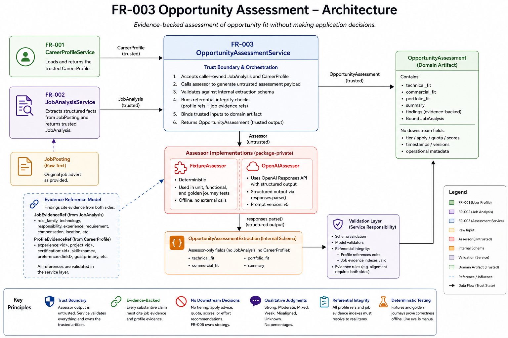

# Implementation Notes

Durable engineering notes for the implemented system. This document records data
provenance, intentional deviations from approved plans, and a backlog of known
improvements. It complements — and does not override — the authoritative documents in
[00_repository_guide.md](00_repository_guide.md).

---

## FR-003 Opportunity Assessment — Architecture and Verification Overview



*FR-003 architecture and verification overview — service flow, trust boundaries,
assessor implementations, evidence model, design principles, and closeout guidance.*

### Purpose

FR-003 compares a trusted `CareerProfile` (FR-001) with a trusted `JobAnalysis` (FR-002)
and produces an evidence-backed `OpportunityAssessment`. It assesses fit across Technical,
Commercial, and Portfolio dimensions. It does **not** decide whether the user should apply,
assign an application tier, or allocate JobSeeker effort — those concerns belong to
downstream strategy (especially FR-005).

### Inputs and output

| Direction | Artifact |
|-----------|----------|
| Input | `CareerProfile` from `CareerProfileService` |
| Input | `JobAnalysis` from `JobAnalysisService` |
| Output | `OpportunityAssessment` with `technical_fit`, `commercial_fit`, `portfolio_fit`, `summary`, evidence-backed findings, and the caller-owned `JobAnalysis` |

### Service composition

```
CareerProfileService
        ↓
CareerProfile

JobPosting
        ↓
JobAnalysisService
        ↓
JobAnalysis

JobAnalysis + CareerProfile
        ↓
OpportunityAssessmentService
        ↓
OpportunityAssessment
```

### Trust boundary

`OpportunityAssessmentService` is the public trust boundary (mirrors FR-002):

1. Callers supply validated `JobAnalysis` and `CareerProfile` plus an explicit assessor.
2. The assessor returns an untrusted `OpportunityAssessmentPayload` that must **not**
   include `job_analysis`, `profile`, or `career_profile`.
3. The service rejects embedded caller-owned inputs, binds the original `JobAnalysis`,
   validates schema, and checks referential integrity of job and profile evidence refs.
4. Invalid references are rejected as `OpportunityAssessmentValidationError`.
5. The LLM never owns the final trusted domain artifact.

There is **no silent production default assessor** — callers must inject one.

### Assessor implementations

| Assessor | Role |
|----------|------|
| **`FixtureAssessor`** | Deterministic offline scaffolding. Matched by shared FR-002 fixture markers in `job_analysis.posting.raw_text`. Used in unit, functional, and golden journey tests. Never a public default. |
| **`OpenAIAssessor`** | Package-private live path via OpenAI Responses API (`responses.parse`) into internal `OpportunityAssessmentExtraction`. Extraction findings use a kind-discriminated schema so required `job_evidence` / `profile_evidence` arrays carry `minItems` in JSON Schema (domain `FitFinding` validators stay fail-closed and unchanged). Prompt version **v11**. Default model `gpt-4o-mini`. Client injectable for offline tests. Not exported from `career_intelligence.opportunity_assessment`. |

### Evidence model

- **`JobEvidenceRef`** cites facts from the bound `JobAnalysis` (`source`, optional
  `item_index`, optional excerpt).
- **`ProfileEvidenceRef`** cites facts from the bound `CareerProfile` using
  `namespace:id` refs (e.g. `skill:Python`, `project:governance-document-rag`,
  `preference:remote`).
- Alignments, partial alignments, transferable alignments, and conflicts require
  evidence from **both** sides.
- Gaps require at least one job evidence ref; profile evidence may be empty.
- List sources (`technology`, `responsibility`, `experience_requirement`) require a
  valid `item_index`. Scalar sources (`role_family`, `seniority`, `compensation`,
  `location`, `work_arrangement`, `employment`) must omit `item_index`.

### Qualitative judgments

Permitted dimension judgments: `strong`, `moderate`, `mixed`, `weak`, `misaligned`,
`unknown`. FR-003 deliberately avoids numerical fit percentages and interview
probabilities.

### Experience honesty

Profile experience kinds remain distinct:

- `employment`
- `independent_engineering`
- `professional_development`
- portfolio / project evidence

Independent engineering and portfolio projects may demonstrate capability via
`partial_alignment` or `transferable_alignment`. They must **not** be described as
commercial AI employment or paid commercial AI tenure unless an employment entry
supports that claim.

### Scope boundary — not produced by FR-003

Apply, Skip, Defer, application tiers, effort recommendations, JobSeeker quota logic,
`SearchOperatingContext`, interview probabilities, or percentage fit scores. Deferred to
FR-005 and later strategy stages.

### Approved design decisions

- `OpportunityAssessment` is a pure business-domain artifact (no
  `profile_schema_version`, no operational metadata).
- JobSeeker quota and `SearchOperatingContext` remain FR-005 concerns.
- Candidate working rights are never inferred from location, citizenship, or history.
- `salary_min = null` means no candidate salary threshold — do not invent conflict from
  currency alone.
- Live OpenAI evaluation closed at **PARTIAL PASS**; offline architecture and golden
  journeys remain authoritative for CI.

### Implementation status

Delivered:

- Domain models and validators
- `OpportunityAssessmentService` + assessor protocol
- Deterministic assessment fixtures keyed by shared FR-002 markers
- Functional acceptance suite (`tests/functional/test_fr003_acceptance.py`)
- `OpenAIAssessor` with structured output and prompt versioning through **v11**
- Per-request catalogue ``enum`` on extraction ``profile_evidence[].ref`` plus narrow
  serialisation-punctuation canonicalisation before domain validation (domain
  ``ProfileEvidenceRef`` remains fail-closed; no fuzzy mapping)
- Per-request ``item_index`` enums on source-specific extraction job-evidence types
  (technology / responsibility / experience_requirement), derived from the bound
  JobAnalysis collection lengths; coerce rejects out-of-range indexes (domain
  ``validate_references`` unchanged)
- Live manual evaluation ([eval/fr003_openai_manual_eval.md](eval/fr003_openai_manual_eval.md))
- Cross-stage golden journeys (`tests/golden/test_opportunity_assessment_user_journey.py`)
- FR-001 → FR-002 → FR-003 offline integration

### Testing and evaluation evidence

Automated tests are offline only. Live API calls use
`tools/manual_eval_openai_assessor.py` and are not part of CI.

| Suite | Result (Phase H verification) |
|-------|-------------------------------|
| Golden journey | **8 passed** |
| FR-003 unit + functional + golden | **94 passed** |
| Full suite | **260 passed** |

### Known limitations (accepted at closeout)

1. **`salary_min=null`** — live model may occasionally describe salary friction with no
   candidate threshold.
2. **Sparse-specification variance** — thin adverts can yield run-to-run variation or
   incomplete evidence.
3. **Scalar `item_index`** — live model may attach an unnecessary `item_index` to scalar
   job evidence (schema allows; prompt discourages).
4. **JobAnalysis dependency** — assessment quality partly tracks upstream FR-002 stability.
5. **Live nondeterminism** — manual evaluation only; not suitable for deterministic CI.

Validation catches structural failures (empty evidence, bad refs, assumption misuse)
where possible. These limitations do not invalidate the offline architecture. Revisit
through observed production evidence rather than speculative prompt churn.

### Prompt evolution (v1 → v11)

| Version | Justifying live failure |
|---------|-------------------------|
| v1 | Initial instructions |
| v2 | Bare profile refs without `namespace:id` |
| v3 | Empty `job_evidence`; `assumption` field misuse |
| v4 | Persistent empty evidence — cite-as JSON in input catalogue |
| v5 | Portfolio-only findings; scalar `item_index` discipline |
| v6 | Bare profile refs recurred (`Python`, project/experience ids, `salary_min`) because `<CareerProfile>` JSON exposed copyable bare identifiers; assessor input now catalogues complete refs only and rewrites profile pointers as `ref=` |
| v7 | `partial_alignment` / `transferable_alignment` with `profile_evidence=[]` on hybrid AI Product Manager roles; per-kind evidence contract + `<ProfileEvidenceCiteGuide>` |
| v8 | Non-assumption findings populated `assumption` text (Kogan Senior AI Engineer); `<FindingFieldGuide>` + explicit assume-only-when-kind rule |
| v9 | Job 009 Forever New: `commercial_fit=strong` despite material production LLM/agent gap; mis-grounded retail alignment via nbn; judgment must reflect material gaps; industry evidence must match |
| v10 | Job 010: catalogue experience ref emitted with trailing `.` (`chase-risk-compliance-ai-engineer.`); exact-token copy rule |
| v11 | Job 012: `portfolio_fit` alignment with `job_evidence=[]`; dual-evidence portfolio example + hard rule restated |

Current: `ASSESSMENT_PROMPT_VERSION = "v11"`.

### Fixture marker ownership

Shared markers such as `[CIC-FIXTURE:no-technologies]` and
`[CIC-FIXTURE:working-rights]` live in `job_analysis.fixtures`. Assessment payloads live
in `opportunity_assessment.fixtures` and key off the same markers. Fixture implementations
are not public exports.

---

## FR-002 Job Analysis — Implementation Notes

### Architecture

`JobAnalysisService` is the public trust boundary. Callers supply a validated
`JobPosting` and an explicit extractor. The extractor returns an untrusted
`JobAnalysisPayload` that must **not** include `posting`. The service rejects
embedded postings, binds the caller-supplied `JobPosting`, and validates a
trusted `JobAnalysis`.

```
Caller-owned JobPosting
        ↓
JobAnalysisService
        ↓
JobExtractor
        ↓
JobAnalysisPayload (untrusted)
        ↓
Service rejects embedded posting
        ↓
Service binds original JobPosting
        ↓
JobAnalysis.model_validate(...)
        ↓
Trusted JobAnalysis
```

### Extractors

- **`FixtureExtractor`** — deterministic offline scaffolding for tests. Matched by
  fixture markers in `raw_text`. Never a public default; callers must pass it
  explicitly.
- **`OpenAIJobExtractor`** — production-oriented extractor using the official OpenAI
  Python SDK Responses API (`client.responses.parse`) with structured output
  (`text_format=JobAnalysisExtraction`). Requires `openai>=1.66.0` (first release
  shipping `/v1/responses` and `responses.parse`). Default model: `gpt-4o-mini`
  (current default only). Configuration is limited to API key (SDK `OPENAI_API_KEY`
  or constructor override), model, and timeout. An OpenAI client may be injected for
  offline tests.
- **Complete posting input** — the extractor formats trusted `JobPosting` metadata as
  tagged sections (`JobTitle`, `Company`, `SourceURL`, `JobDescription`) so the model
  sees provenance, not only the description body. Titles often carry seniority that the
  body never repeats (e.g. "Principal AI Engineer"); analysing the complete posting
  prevents under-classified seniority. Location is not a `JobPosting` field today and is
  still extracted from the description into `LocationInfo`. `SourceURL` is provenance
  only. Responsibilities and technologies remain body-led. Trust boundary unchanged:
  caller-owned posting → extractor payload without `posting` → service bind/validate.

### JobAnalysisExtraction

Internal Pydantic model listing exactly the fields an extractor may produce
(all `JobAnalysis` fields except `posting`). Nested domain types are reused; the
model is checked in (not created with `create_model` or JSON Schema surgery). It
is not exported from `career_intelligence.job_analysis`. A unit parity test locks
field-set equality against `JobAnalysis` minus `posting`.

### Prompt

`extraction_prompt.py` holds `EXTRACTION_PROMPT_VERSION` and
`EXTRACTION_INSTRUCTIONS_V1` (constant name retained across versions). Instructions
forbid candidate comparison, recommendations, invention of missing facts, and emission
of `posting`.

#### Prompt evolution (why, not only what)

Live evaluation — not offline fixtures alone — forced successive prompt hardening.
Domain validators stayed strict; prompts had to teach the model the same discipline.
Full evaluation narrative:
[eval/fr002_openai_manual_eval.md](eval/fr002_openai_manual_eval.md).

| Version | Intent | Outcome |
|---------|--------|---------|
| **v3** | Tagged complete posting (`JobTitle`, `Company`, `SourceURL`, `JobDescription`); prefer clear title seniority with `"Job title"` evidence | Fixed body-only under-classification (e.g. Principal only in title) |
| **v4** | Strict employment non-inference: set `working_hours` / `engagement_type` only from explicit wording; otherwise unspecified | Fixed invented full-time/permanent; **regressed** global evidence — known claims emitted `evidence=[]` |
| **v5** | Compact **global** evidence rule near the top (every known claim needs an excerpt); keep employment non-inference; drop “empty evidence” negative heading that generalised badly | Restored evidence discipline without weakening employment rules |
| **v6** | De-prioritise SEEK/job-board chrome; split grouped technologies; extract multiple employer-authored responsibilities; retain required/preferred/unspecified | Addresses manual-validation under-extraction and chrome contamination |
| **v7** | Hybrid role-family guidance; prefer dominant profession over supporting AI/automation tech; add `network_engineering`; reinforce evidence for known families including `other` | Fixes Capgemini Network Engineer Automation & AI empty-evidence `other` failure |
| **v8** | `posting_identity` (title/company + evidence) extracted when present; service binds grounded values into missing `JobPosting` fields (M4a) | Blank title/company on persist/list/compare when CLI provenance omitted |

**Why prompt engineering was required:** OpenAI strict structured output requires the
`evidence` field but allows empty arrays. Validators catch empty evidence after the
fact. The model follows the loudest recent instructions — an employment-centric
“leave evidence=[] when unspecified” pattern generalised to technologies and
responsibilities. A short global evidence rule must stay prominent so field-specific
rules cannot displace it.

### Testing

All automated tests run offline. OpenAI coverage injects a tiny fake client with a
`responses.parse` method — no network, no API credits, no deep SDK mocks. Functional
tests cover both `FixtureExtractor` and `OpenAIJobExtractor` through
`JobAnalysisService`.

**Regression approach:** live failures become offline fixtures through the fake
client — title-only Principal seniority, employment non-inference (Software Engineer
(AI) / Principal), known claims with required evidence, and empty-evidence payloads
that must still raise `JobAnalysisValidationError`. Manual live checks remain in
[eval/fr002_openai_manual_eval.md](eval/fr002_openai_manual_eval.md).

---

## FR-001 Career Profile — Data Provenance

Every value in `data/career_profile.yaml` falls into one of three categories. Values that are
assumed/inferred are marked `OWNER-CONFIRM` in the profile until the owner confirms or corrects
them, because they influence real assessments (notably FR-003 Commercial Fit).

**Status: all flagged values were confirmed by the owner on 2026-07-19.** The Chase R&D start
date was corrected from the inferred 2023-11 to the owner-provided **2025-12**; goals,
locations, full-time employment, flexible remote arrangement, AUD currency with no salary
minimum, and the must-haves were confirmed as recorded.

### Evidence strength (capability demonstration)

Skills remain truthful claims. Downstream planners may distinguish *how* a skill is
demonstrated via `SkillEvidenceRef.kind` (or legacy `Skill.evidence` resolved against
experience/project/certification ids). Ordering is explainable, not a weighted score:
employment → independent engineering → portfolio project → certification → professional
development → coursework → unspecified. See
[docs/eval/career_profile_evidence_model_refinement.md](eval/career_profile_evidence_model_refinement.md).

### Confirmed from the Master CV

- Identity: full name, target role (AI Engineer), professional summary.
- Experience: nbn Australia — Data Engineer, Mar 2020 to Oct 2023 (organisation, title, dates,
  highlights, technologies). Classified `kind: employment`.
- Experience: Chase Risk & Compliance — AI Engineer, Independent Research & Development
  (organisation, title, highlights, technologies). Start date is inferred — see below.
  Classified `kind: independent_engineering`: an independent AI Engineering R&D and portfolio
  brand, not paid employment, consulting, or commercial delivery.
- Projects: Operational Intelligence Copilot, Governance-Aware Document Intelligence RAG,
  Payroll Diagnostics Engine, Public Holiday Entitlements Application — names, summaries,
  demonstrated capabilities, technologies, outcomes.
- Technical, domain, and soft skills, each traceable to a CV experience, project, or listed
  professional-development item.
- Certification: AWS Certified Developer - Associate.
- Location: Melbourne, VIC.

### Confirmed from project documentation

- Goals (`primary`, `secondary`, `horizon_notes`) are drawn from the product vision and
  roadmap (Horizon 1). They are consistent with the CV's direction but are the owner's
  objectives and still require owner endorsement.

### Assumed / inferred (owner-confirmed 2026-07-19)

| Value | Original inference | Outcome |
|-------|--------------------|---------|
| Chase R&D `start_date` | The CV states no date; inferred as 2023-11 (month after the nbn role ended). | **Corrected by owner to 2025-12.** |
| `preferences.locations` includes `Remote Australia` | Only Melbourne is on the CV; remote-Australia added as a plausible search scope. | Confirmed. |
| `preferences.employment_types: [full_time]` | Not stated on the CV. | Confirmed — full-time only. |
| `preferences.remote: flexible` | Not stated on the CV. | Confirmed. |
| `preferences.salary_currency: AUD` | Inferred from Australian location. `salary_min` left null. | Confirmed — no salary minimum. |
| `preferences.must_haves` | Inferred from the CV's stated career direction, not an explicit preference. | Confirmed; no deal-breakers added. |

Skill categorisation (technical / domain / soft) and the decision to record "professional
development" items (LangChain/LLM, Microsoft Fabric, Databricks, Snowflake, dbt, Azure Data
Factory) as skills rather than certifications are implementer judgments consistent with the
CV's own labelling; they are not value inventions.

### Career-history refinement (owner-directed, 2026-07-19)

The experience facet was refined so entries are typed by
`kind: employment | independent_engineering | professional_development` and the employer-only
field `company` was renamed `organisation`. Owner-provided timeline:

- **nbn Australia** (Mar 2020 – Oct 2023) — `employment`.
- **Data Engineering Professional Development and Career Transition**
  (Oct 2023 – Jun 2025) — `professional_development`; began with a personal break, then
  structured upskilling across Microsoft Fabric, Databricks, Snowflake, dbt, and Azure Data
  Factory.
- **AI Engineering Professional Development and Portfolio Development**
  (Jul 2025 – Nov 2025) — `professional_development`; deliberate pivot to AI Engineering.
- **Chase Risk & Compliance** (Dec 2025 – present) — `independent_engineering`; independent
  AI Engineering R&D and portfolio brand. Not employment, clients, revenue, consulting, or
  commercial delivery.

Skill evidence previously recorded under the informal `professional-development:master-cv`
namespace now cites the relevant professional-development experience IDs. No new top-level
career-phase ontology, separate collections, or project attribution links were introduced.

Deliberately not modelled (present on the CV, out of scope for decision support): contact
details, citizenship, and portfolio/GitHub URLs. These become relevant only for the deferred
CV-generation requirements.

**Enrichment sprint (owner-confirmed, 2026-07-23).** General Assembly technologies gained
`NLP` and `Web Scraping` as course-only evidence on that experience entry; they are not
global Skills. Java, Ruby on Rails, and Gherkin remain historical experience technologies
only. Project and certification `url` fields stay null until the owner confirms per-project
canonical links (certification URLs explicitly deferred). Personal links for CV generation
belong on FR-006 `ContactDetails` (owner-confirmed values for callers: email
`djcropster@gmail.com`, phone `0400 811 545`, GitHub
`https://github.com/dcrops`, portfolio
`https://journey.chaseriskandcompliance.com.au/`, LinkedIn
`https://www.linkedin.com/in/david-cropper/`). See
[docs/eval/career_profile_enrichment_report.md](eval/career_profile_enrichment_report.md).

### Accuracy and provenance refinement (owner-supplied, 2026-07-19)

The Master CV starts the professional history at nbn Australia and understated total
commercial technology experience. The pre-nbn history below is **not on the Master CV**; it
was supplied directly by the owner in an interactive confirmation session on 2026-07-19:

- **Bakers Delight** — Test Analyst (Mar 2009 – Jun 2012), `employment`. Role-level
  responsibilities were not provided; highlights are intentionally empty (flagged
  `OWNER-CONFIRM` in the profile) rather than invented.
- **Console** — Test Analyst (Jun 2012 – Dec 2014), `employment`. Ruby on Rails automation
  scripts, Agile ceremonies, Gherkin/Cucumber user-story tests.
- **Bakers Delight** — Test Analyst (Jan 2015 – Oct 2018), `employment`. POS replacement
  across 750 bakeries in 4 countries; automation framework; Selenium WebDriver with Java;
  Maven and Jenkins; test environments.
- **AccessHQ** — Test Analyst (Oct 2018 – Jun 2019), `employment`. Consultant to Public
  Transport Victoria (PTV): Selenium and API test suites for Myki/PTV systems, mobile and
  functional testing with Jira. Recorded under the employer AccessHQ, not the client PTV.
- **Bakers Delight** — Test Analyst (Aug 2019 – Sep 2019), `employment`. Short return
  engagement; title assumed to match the earlier role (flagged `OWNER-CONFIRM`).
- **General Assembly** — Data Science Immersive (Sep 2019 – Dec 2019),
  `professional_development`. Course projects (job-listing web scraping with NLP/predictive
  modelling; real-estate price analysis) are attributed here, not to Bakers Delight.

The professional summary leads with overall engineering positioning
(**experienced engineer with 10+ years across testing, automation, data
engineering and applied AI engineering**). Role chronology in `experience[]`
remains the authoritative record for domain-specific tenure (including the
~3.5-year commercial Data Engineer period at nbn). Domain-only years claims
must not be the default/headline identity. Forbidden reinterpretations include
“10+ years of AI engineering”, “10+ years as an AI Engineer”, “10+ years of
data engineering”, “10+ years of data and AI engineering”, and “10+ years of
commercial AI engineering”.

**Certifications.** `Certification` gained a required `status: active | expired` and an
optional `expiry_date` (`YYYY-MM`) so credentials are represented truthfully. Owner-supplied
statuses (2026-07-19): Databricks Certified Data Engineer Associate — **expired** Jul 2026;
Databricks Certified Data Engineer Professional — active until Aug 2026; AWS Certified
Developer - Associate — active until Sep 2026. The two Databricks credential names are
owner-supplied; the CV lists Databricks only as professional development. Note: an earlier
owner instruction described both AWS and Databricks certifications as expired; the owner
superseded this during the confirmation session by choosing the recorded expiry dates, under
which only the Databricks Associate credential has expired as of Jul 2026.

**PyTest at nbn** is owner-confirmed genuine usage during nbn employment and is retained as
nbn evidence.

---

## Deviations from the Approved FR-001 Plan

Both deviations are intentional and preserve the plan's intent; neither changes an
architectural decision, so ADR-001 is unchanged.

1. **Preference validation.** The plan listed a model validator: "preferences must include at
   least one location or an explicit remote preference." This was implemented structurally
   instead — `Preferences.remote` is a required field with no default, so an explicit remote
   preference is always present. The standalone validator was therefore removed as redundant.

2. **Inferred employment date placement.** The plan did not specify where to record inferred
   values. The Chase R&D start-date inference was initially written as an experience
   `highlight`; it has been moved to a YAML `OWNER-CONFIRM` comment so that `highlights`
   contains only genuine achievements and does not feed a meta-note into downstream portfolio
   or fit analysis.

---

## Future Improvements (Backlog)

Known, accepted technical debt from the FR-001 engineering review. These are intentionally
deferred, not defects. Evaluate against the dual-value test before promoting any item.

- **De-duplicate validation translation.** The `pydantic.ValidationError` to
  `ProfileValidationError` conversion exists in both `storage/yaml_store.py` and
  `profile/service.py`. Extract a single shared helper.
- **De-duplicate date parsing.** The `YYYY-MM` `parse_month` validator is repeated in
  `ExperienceEntry` and `Certification`. Extract a shared reusable validator or annotated type.
- **Install-safe default profile path.** `DEFAULT_PROFILE_PATH` assumes the editable repo
  layout (`parents[3]/data/...`) and the `data/` directory is not packaged. Resolve via
  packaged resources or require `CIC_PROFILE_PATH` before any non-editable install.
- **Evidence resolution.** Skill/`demonstrates` `evidence` strings are free text and are not
  checked against real experience/project IDs. (The informal
  `professional-development:master-cv` namespace was retired in the career-history refinement;
  all skill evidence now cites `experience:` or `project:` IDs.) FR-003 validates
  `ProfileEvidenceRef` / `JobEvidenceRef` integrity at assessment time; skill-evidence
  strings inside the career profile itself remain unchecked.
- **Project attribution links.** Projects are not linked to the independent-engineering
  context that produced them. A `context_id` reference to an experience entry may aid
  explainability; deliberately excluded from the career-history refinement. FR-003 cites
  projects and experience kinds separately via evidence refs.
- **Profile load caching.** `get_section` and `summary` each re-read and re-parse the file.
  Acceptable for occasional interactive use; revisit if a downstream flow reads many sections
  per operation.
- **Typed section access.** `CareerProfileService.get_section` returns `Any`. Downstream
  consumers should prefer `load()` for full typing; consider typed accessors or overloads if a
  dynamic section API proves necessary.

---

## FR-004 Portfolio Matching — Architecture Notes

### Purpose

FR-004 ranks portfolio projects for a trusted `CareerProfile` and `JobAnalysis`, producing
a separate `PortfolioMatch` artifact. It answers which projects should lead, in what order,
and why. It does **not** assess overall portfolio fit, assign tiers, or recommend Apply/Skip.

### Sibling boundary with FR-003

| Concern | FR-003 Portfolio Fit | FR-004 Portfolio Match |
|---------|----------------------|------------------------|
| Question | Does the portfolio support the role? | Which projects should lead, and why? |
| Inputs | CareerProfile + JobAnalysis | CareerProfile + JobAnalysis |
| Dependency | None on Portfolio Match | None on OpportunityAssessment |
| Output facet | `portfolio_fit` dimension | Ranked `PortfolioMatch` artifact |

Do not modify, replace, or repurpose `OpportunityAssessment.portfolio_fit` for ranking.

### Inputs and output

| Direction | Artifact |
|-----------|----------|
| Input | `CareerProfile` from `CareerProfileService` |
| Input | `JobAnalysis` from `JobAnalysisService` |
| Output | `PortfolioMatch` with `ranked_projects`, `unranked_project_ids`, `summary`, `insufficient_evidence`, and the caller-owned `JobAnalysis` |

### Service composition

```
CareerProfileService → CareerProfile
JobAnalysisService   → JobAnalysis

CareerProfile + JobAnalysis
        ↓
PortfolioMatchingService
        ↓
PortfolioMatch
```

Opportunity Assessment is not on this path.

### Trust boundary

`PortfolioMatchingService` mirrors FR-002/FR-003:

1. Callers supply validated `JobAnalysis` and `CareerProfile` plus an explicit matcher.
2. The matcher returns an untrusted payload that must **not** include `job_analysis`,
   `profile`, or `career_profile`.
3. The service binds the original `JobAnalysis`, validates schema, and checks project
   coverage plus evidence-reference integrity.
4. There is **no silent production default matcher**.

### Matcher implementations

| Matcher | Role |
|---------|------|
| **`DeterministicMatcher`** | Production ranking path. Distinctive technology hits, capability-family overlap, responsibility/demonstrates token overlap; generic stack terms demoted in sort order. Package-private; inject explicitly. |
| **`FixtureMatcher`** | Offline canned payloads keyed to shared FR-002 markers (plus `MARKER_PORTFOLIO_TIE`). Never a public default. |

### Ranking behaviour (deterministic)

- Match job technologies against project `technologies`, `demonstrates`, `summary`, `outcomes`.
- Match job responsibilities against project `demonstrates`, `summary`, `outcomes`, `technologies`.
- Match shared **capability families** (orchestration, workflows/pipelines, agents,
  RAG/retrieval, LLM/generative, explainability/governance, evaluation/LLMOps, HITL
  review, production AI lifecycle, document generation) between job evidence and project
  narrative — `capability_overlap` factors.
- Emit explainable `RankingFactor` entries with job + `project:<id>` profile evidence.
- Sort order (lexicographic counts): distinctive required tech → distinctive preferred
  tech → demonstrates → responsibility → capability overlap → **generic** required tech →
  generic preferred → unspecified → stable `project_id`.
- Generic stack terms (`Python`, `SQL`, `REST`/`API`, `Docker`, `Git`, …) still emit
  technology factors for explainability but are demoted in the sort key so they cannot
  outrank demonstrates-heavy AI projects (Allura/Mars Public Holiday inflation fix).
- Capability overlap supports agentic/RAG/HITL relevance (including Career Intelligence
  Copilot when evidence supports it) without overriding denser demonstrates leads
  (Bluefin Ops preservation).
- Zero-factor projects go to `unranked_project_ids`.
- Empty technologies and responsibilities → `insufficient_evidence=True`, all projects unranked.
- Equal primary keys share `tie_group`; display order uses stable `project_id` ascending.

No percentage scores, embeddings, or retrieval infrastructure. Career Intelligence Copilot
is not force-ranked; it rises when job evidence shares agentic/workflow/HITL/document-
generation capability families with its project narrative.

### Known limitations

- Shared baseline technologies (e.g. Python across all projects) can still produce honest
  ties when the job has no distinctive stack or capability evidence — accepted for
  non-target role families such as Data Engineer; do not invent distinguishing evidence.
- Capability families are phrase/token based; they do not replace responsibility overlap.
- Token/phrase overlap is intentionally simple; an optional narrative layer may be considered
  later only if deterministic rationales prove too thin in live use.
- Fixture match payloads are aligned to the golden career profile project set.

---

## FR-005 Application Strategy — Architecture Notes

### Purpose

FR-005 produces an evidence-backed `ApplicationStrategy` from trusted
`CareerProfile`, `OpportunityAssessment`, and `PortfolioMatch` inputs. It answers how
to pursue the opportunity (posture), how much effort is justified (tier), what to do
next (advisory `next_actions`), and what could change the recommendation — without
autonomous apply/skip or content generation.

### Downstream consumption of siblings

```
CareerProfile + JobAnalysis
        ├─→ OpportunityAssessment (FR-003)
        └─→ PortfolioMatch (FR-004)
                  ↓
        ApplicationStrategyService
                  ↓
          ApplicationStrategy
```

Application Strategy does **not** redo job extraction, fit assessment, or portfolio
ranking. Portfolio emphasis copies Portfolio Match order (cap 3); it does not rerank.

### Trust boundary

`ApplicationStrategyService` mirrors FR-002–004:

1. Callers supply validated assessment, portfolio match, profile, and an explicit planner.
2. Optional `SearchOperatingContext` defaults to `volume_applications_enabled=False`.
3. Planner returns an untrusted payload that must **not** embed trusted inputs.
4. Service rejects mismatched OpportunityAssessment / PortfolioMatch posting identity,
   binds `job_analysis` from the assessment, validates schema and evidence refs.
5. There is **no silent production default planner**.

### Planner implementations

| Planner | Role |
|---------|------|
| **`DeterministicStrategyPlanner`** | Production recommendation path. Explicit rule-based policy over fit judgments, role family, preferences, Portfolio Match, and volume context. Package-private; inject explicitly. |
| **`FixtureStrategyPlanner`** | Offline canned payloads keyed to shared FR-002 markers (plus strategy-only markers). Never a public default. |

### Recommendation semantics

- **PursuitPosture** — primary recommendation
- **ApplicationTier** — Platinum / Gold / Silver / **Bronze** (effort only; Bronze ≠ never apply)
- **next_actions** — closed `consider_*` taxonomy; recommendations only
- Final apply / skip / defer — owner decision (Phase 2 M2 / FR-013)

### Seniority stretch policy

`DeterministicStrategyPlanner` treats explicit seniority mismatch for AI-target families
as a credible stretch, not automatic rejection:

- Inputs used: `JobAnalysis.seniority` and job leadership/executive language,
  Opportunity Assessment findings (commercial and technical), `CareerProfile.experience.kind`,
  and commercial fit judgment.
- Direct senior commercial AI evidence requires `employment` experience that is AI-related
  and shows senior ownership / leadership / production markers. Independent engineering
  does not satisfy that evidence bar.
- Cap triggers from material OA senior/leadership gap findings **or** JobAnalysis text
  signalling executive / commercial leadership expectations (not bare “Senior” title alone).
- Cap: `consider` / Silver / `acceptable_opportunity`; targeted effort when technical and
  portfolio fits are strong. Gold remains possible when matching commercial evidence exists.
- Not a title-only or employer-specific rule.

### Five-question standard

Answered via existing fields: `reasons`, `risks_or_gaps`, `next_actions`, evidence refs,
`manual_checks`, `assumptions` / `decision_blockers`.

### Known limitations (accepted at closeout)

1. Deterministic recommendation policy only — no mandatory OpenAI narrative synthesis.
2. No CV / cover-letter generation, outreach, or application submission.
3. No autonomous apply/skip commitment; `owner_review_required` is always true.
4. Traditional Data Engineer roles are not specially optimised for the AI search.
5. Fixture marker coverage is intentionally narrower than production-policy unit coverage;
   prefer DeterministicStrategyPlanner for product-behaviour assertions.
6. Soft location mismatch (e.g. Sydney hybrid vs Melbourne preference) can reduce an
   otherwise strong opportunity from prioritise/platinum to pursue/gold — intentional.
7. Location soft-matching normalizes punctuation, whitespace, parenthetical arrangement
   suffixes, and common Australian state aliases (`VIC`/`Victoria`). False conflicts
   between `Melbourne, VIC` and `Melbourne VIC (Hybrid)` were fixed after manual
   validation Job 001; genuine city mismatches still warn.

### Manual validation closeout (engineering reasoning)

Owner live validation of FR-001→FR-005 is **complete**. Notes:
[manual_validation/jobs/manual_validation_notes.md](../manual_validation/jobs/manual_validation_notes.md).

**Why Job 009 was an FR-003 issue, not an FR-005 issue.** Forever New produced
prioritise / platinum because Opportunity Assessment emitted `commercial_fit=strong`
(and related over-strong alignments) despite recording a material production LLM/agent
delivery gap and mis-grounding retail industry evidence on nbn employment. Application
Strategy mapped those judgments correctly under existing rules. Changing FR-005 thresholds
would have papered over bad upstream fit labels; fixing FR-003 calibration restored
consider / silver without redesigning strategy policy.

**Why FR-005 thresholds were intentionally not modified for Job 009.** Strategy policy
already encodes seniority stretch, AI-target families, and volume mode. The defect was
mis-calibrated commercial judgment and evidence grounding. Threshold churn would couple
strategy to every upstream wording variance and obscure the real contract: trust only
validated assessments.

**Why fail-closed validation is preferred over silent repair.** Malformed model output
(empty required evidence, trailing punctuation on catalogue refs, assumption field misuse,
mis-grounded industry/production alignments) must fail visibly. Silent insertion, stripping,
or downgrade of findings would hide generator regressions and teach the pipeline to accept
untrustworthy evidence. Prompt and cite-guide hardening reduce recurrence; validators stay
strict.

**Why independent engineering supports capability but not commercial employment.** Profile
`independent_engineering` / portfolio projects legitimately strengthen technical and
portfolio fit. They do not establish commercial production employment or senior commercial
AI ownership. Treating them as employment evidence produced Job 009’s over-strong commercial
judgment and would defeat the seniority-stretch employment bar in FR-005.

**Why validation now has a defined endpoint.** Jobs 001–013 covered strong AI matches,
senior stretch, hybrid/adjacent roles, and post-calibration regression (Pisell, Officeworks,
Maincode evidence-contract fix, pay.com.au). Remaining defects belong in normal regression
tests and prompt-version discipline — not an open-ended reopening of this validation phase.

### Owner manual validation runner

There was no existing full-pipeline CLI for FR-001→FR-005. Use:

`scripts/run_application_strategy_manual.py`

**Setup**

- Install the package in editable mode (`pip install -e ".[dev]"`).
- Live path requires `OPENAI_API_KEY` (OpenAI Python SDK).
- Profile defaults to `data/career_profile.yaml`, or override with `CIC_PROFILE_PATH` /
  `--profile-path`.

**Live real-job command**

```bash
python scripts/run_application_strategy_manual.py \
  --job-file path/to/real_job.txt \
  --title "AI Engineer" \
  --company "Example Co" \
  --source-url "https://example.com/jobs/123"
```

When ``--job-file`` is set and ``--output-json`` is omitted, the runner writes
``manual_validation/outputs/live/{job_file stem}.json`` so FR-006 / FR-007 can reuse
the trusted strategy. Override the path with ``--output-json`` when needed:

```bash
python scripts/run_application_strategy_manual.py \
  --job-file path/to/real_job.txt \
  --output-json artifacts/manual_strategy.json
```

**Corpus stewardship:** unit tests and the FR-006b golden suite read immutable
strategy JSON from ``tests/fixtures/application_strategy/``. Live owner runs write
only under ``manual_validation/outputs/live/`` and must not mutate the fixture tree.
CV planner ``jd_priorities`` is capped at ``_MAX_JD_PRIORITIES`` (8); late-listed JD
technologies may be omitted from that list.

**Job evidence indexes:** extraction structured output enums ``item_index`` per
list collection (technology / responsibility / experience_requirement) from the
bound JobAnalysis lengths. Out-of-range values are rejected at the extraction
boundary and again by domain reference validation (fail-closed; no clamp).

Optional volume mode:

```bash
python scripts/run_application_strategy_manual.py \
  --job-file path/to/real_job.txt \
  --volume-applications-enabled
```

Stdin is also supported when `--job-file` is omitted (non-interactive pipe only).

**Offline smoke (explicit fixtures only)**

Requires a job text containing a recognised `[CIC-FIXTURE:…]` marker. Write the file
as UTF-8 (on PowerShell prefer Python write, not `>` redirection which may emit UTF-16):

```bash
python -c "from pathlib import Path; from career_intelligence.job_analysis.fixtures import posting_applied_ai_engineer; Path('tmp_fixture_job.txt').write_text(posting_applied_ai_engineer().raw_text, encoding='utf-8')"

python scripts/run_application_strategy_manual.py \
  --job-file tmp_fixture_job.txt \
  --offline-fixtures \
  --title "Applied AI Engineer" \
  --company "Harbour Labs"
```

`--offline-fixtures` is never implied. Without it, a missing API key fails clearly.

**Component modes**

| Stage | Live default | Offline smoke |
|-------|--------------|---------------|
| Career profile | YAML via `CareerProfileService` | same |
| Job analysis | `OpenAIJobExtractor` | `FixtureExtractor` (explicit) |
| Opportunity assessment | `OpenAIAssessor` | `FixtureAssessor` (explicit) |
| Portfolio match | `DeterministicMatcher` | `DeterministicMatcher` |
| Application strategy | `DeterministicStrategyPlanner` | `DeterministicStrategyPlanner` |

`FixtureStrategyPlanner` is **not** used by this runner.

**FR-006 CV Generation (complete):** after strategy is trusted, use
`scripts/run_cv_generation_manual.py` for Tailoring Plan + Tailored CV drafts.
Phase A/B are deterministic. Phase C summary rewrite is opt-in via
`--rewrite-summary` (OpenAI `gpt-4o-mini`, fail-soft to profile summary; prompt
**v2**). The Phase C runner applies the same Windows SSL preparation as FR-002/003 live
manual paths (`truststore.inject_into_ssl()` before constructing
`OpenAISummaryRewriter`), because corpus FR-006 runs reuse saved strategy JSON
and otherwise never enter that branch.
For the FR-005 real-job corpus, the FR-006 runner **reuses**
saved `manual_validation/outputs/{stem}.json` (or `--strategy-json`). Do **not**
use `--offline-fixtures` for those ads — that flag is only for `[CIC-FIXTURE:…]`
smoke texts. Validation procedure:
[eval/fr006_manual_validation.md](eval/fr006_manual_validation.md).
Phase C design:
[eval/fr006_phase_c_design.md](eval/fr006_phase_c_design.md).

### FR-006 — architecture and Phase C summary rewrite

End-to-end path:

```
Career Profile → Job Analysis → Opportunity Assessment → Portfolio Match
  → Application Strategy → Deterministic Tailoring Plan → CV Generation
  → Optional OpenAI Summary Rewrite → Owner Review
```

| Piece | Role |
|-------|------|
| `DeterministicTailoringPlanner` / `TailoringPlanService` | Authoritative emphasis |
| `CvGenerationService` | Pure render; optional rewriter injection |
| `SummaryRewriter` protocol | Package-private rendering seam |
| `OpenAISummaryRewriter` | Live path; instructions from `prompts/cv_summary_v2.md` |
| `FixtureSummaryRewriter` | Offline deterministic stub for tests |
| `summary_validation` | Allowlist / prohibition checks; fail-soft on failure |
| `CvGenerationOptions.rewrite_summary` | Default `False` (opt-in Phase C) |
| `CvGenerationOptions.presentation` | Default `submit` (employer-facing); `review` keeps plan meta. Submit Markdown/HTML must not embed internal workflow notices such as “Owner review required…”; that gate stays on models, JSON, package, and CLI. |
| `TailoredCv.summary_source` | `theme_aware_composition` (default Phase B) \| `profile_copy` \| `openai_rewrite` \| `fixture_rewrite` \| `fallback_profile_copy` |

**FR-006b (quality):** Submit-ready Markdown is owned by `render_markdown` (hierarchy,
skills curation, bolding, dates, Master-aligned section labels, methodology block).
Planner role-family anchors, relevance project ranking, and highlight selection improve
tailoring. Profile may include `selected_engineering_highlights` and
`engineering_methodology`. Golden suite: `scripts/run_fr006b_golden_suite.py` —
see [eval/fr006b_cv_quality_validation.md](eval/fr006b_cv_quality_validation.md).

**FR-006c (Summary Intelligence):** When Phase C is off, Phase B composes the
Professional Summary via `summary_intelligence.compose_summary_intelligence`
(exposed through `compose_theme_aware_summary`). Pipeline: gather profile/plan
evidence → dominant themes → selling proposition → job-specific emphasis →
credibility-first stable brand paragraph → role-tailored what/how/value
paragraphs → grounded bold scan emphasis (first occurrence) → grounding checks.
Soft ceiling 200 words. Primary job theme promoted once. Still evidence-only;
`summary_source` stays `theme_aware_composition`. Engineering Highlights use
`select_engineering_highlights` (impact lead first, then relevance).
See [eval/fr006c_summary_intelligence.md](eval/fr006c_summary_intelligence.md).

**Tailoring heuristics (quality refinements):** JD technology labels may promote
related profile capabilities via `_RELATED_CAPABILITY_GROUPS` (e.g. JD `Azure` →
profile `Azure Data Factory`; Docker/containers; CI/CD↔Jenkins; observability;
data pipelines). For `ai_engineering` / `ai_adjacent` roles, project re-ranking
weights AI capability signals (LLM, RAG, orchestration, architecture) above
generic REST/API overlap alone. Profile-backed Career Intelligence Copilot may
append after retained strategy emphasis projects; weaker non-AI emphasis entries
may be deferred so CIC is not trapped below commercial/rules-only evidence.
`plan_refs` still requires strategy projects first, then appends — never interleaved.

**Summary Intelligence close:** the forward paragraph prefers advert-aligned tech
accountability wording and must not repeat the methodology catchphrase
“traceable, reviewable outputs”.

Before (legacy theme-aware bridge):

> AI Engineer with strengths in Python, FastAPI, and OpenAI APIs. Background:
> Applying software engineering discipline to build end-to-end AI applications
> with Python, FastAPI, Docker, and OpenAI APIs. …

After (Summary Intelligence):

> Experienced engineer with 10+ years across testing, automation, data
> engineering and applied AI engineering. Builds end-to-end AI applications with
> Python and FastAPI. Applies software engineering discipline — architecture-first
> design, evidence-based validation, and human-in-the-loop review — with
> independent AI Engineering portfolio work across retrieval systems, operational
> intelligence, explainable AI, and enterprise decision support.

**Prompt versions:** `cv_summary_v1.md` (historical), `cv_summary_v2.md` (current —
employer-relevant lead, capabilities before chronology). Bump
`SUMMARY_PROMPT_VERSION` and add `cv_summary_vN.md` for future changes; keep prior
files for diffs.

The LLM never receives raw job-description text and never changes the Tailoring Plan.
FR-006b improves presentation inside the Markdown render layer; generated drafts also
emit standalone HTML via `html_renderer` (shared print CSS; no Pandoc) and PDF via
WeasyPrint (`pdf_renderer.render_pdf_from_html`). DOCX export remains out of scope.

**Document generation vs document rendering:** Generation runs planner → composer →
Markdown/HTML/PDF. **Render-only** (`scripts/render_document.py`, package
`career_intelligence.document_rendering`) re-reads an existing Markdown draft and
rewrites sibling HTML/PDF only — no Job Analysis, assessment, matching, strategy,
planner, composer, or OpenAI. Use it after owner Markdown edits.

**Shared presentation system:** `src/career_intelligence/cv_generation/assets/cv_print.css`
is the single CSS source for Master HTML and tailored HTML. Master embeds the CSS between
`CV_PRINT_CSS_BEGIN/END` markers; keep them aligned with
`python scripts/sync_master_cv_css.py` (use `--check` in CI-style verification). Layout
benchmark is archived Master CV v3 readability; current Master content stays canonical.
Readability is prioritised over minimum page count (≈4–5 pages OK).

Example (deterministic corpus validation):

```bash
python scripts/run_cv_generation_manual.py \
  --job-file manual_validation/jobs/013_pay_com_au_ai_automation_engineer.txt
```

Optional summary rewrite (live OpenAI; requires `OPENAI_API_KEY`):

```bash
python scripts/run_cv_generation_manual.py \
  --job-file manual_validation/jobs/002_bluefin_ai_systems_developer.txt \
  --rewrite-summary
```

**Expected console / artifacts**

Under `career-documents/cv/generated/` (same stem):

- `{stem}.tailoring_plan.json`
- `{stem}.json` (TailoredCv)
- `{stem}.md` (Markdown)
- `{stem}.html` (standalone styled HTML; no Pandoc)

`summary_source` reflects `theme_aware_composition`, `profile_copy`, `openai_rewrite`,
or `fallback_profile_copy`. Owner review remains mandatory before external use.

**Known runner / runtime notes**

- OpenAI rewriting is optional (`rewrite_summary=False` by default).
- Fail-soft: rewrite or validation failure keeps the deterministic CV and copies the
  profile summary; metadata records `fallback_profile_copy`.
- Corpus runs that reuse saved strategy JSON still inject `truststore` before Phase C
  so Windows SSL matches FR-002/003 live manuals.
- Opportunity persistence (M1) is available via `--persist` on the strategy runner —
  see § M1 Opportunity Persistence below.
- Owner decisions / outcomes (M2) via `cic opportunity decide|outcome` —
  see § M2 Decision and Outcome Logging below.
- Does not export CSV or rank open opportunities (M3–M4).
- Does not generate outreach or submit applications.
- Cover letters are FR-007 (`scripts/run_cover_letter_manual.py`) — separate from CV drafts.

---

## FR-007 Cover Letter Generation

**Status:** Complete (2026-07-29) — passed owner manual validation.

**Public boundary:** `career_intelligence.cover_letter`

**Flow:** ApplicationStrategy + CareerProfile → `CoverLetterPlanService` /
`DeterministicCoverLetterPlanner` (incl. `project_selection`) →
`CoverLetterGenerationService` (narrative `composer` + product narratives) →
`write_cover_letter_drafts` (Markdown + HTML + PDF + JSON) under
`career-documents/cover-letters/generated/` (gitignored).

**Presentation:** HTML reuses CV print CSS so cover letters and CVs read as one
document suite. Signature / body portfolio contact matches FR-006 `ContactDetails`.
After owner Markdown edits, re-emit HTML/PDF with
`python scripts/render_document.py --markdown <path>` (render-only; see
§ Document Rendering below).

**Gates:** `owner_approved_to_plan`; material benefit (platinum/gold or
`consider_cover_letter`); `cover_letter_plan_approved`; always
`owner_review_required=True`.

**Manual runner:**

```bash
python scripts/run_cover_letter_manual.py \
  --job-file manual_validation/jobs/002_bluefin_ai_systems_developer.txt
```

Eval / closure: [eval/fr007_cover_letter.md](eval/fr007_cover_letter.md).

**Quality refinements (Mars dogfooding):** Attraction hooks reject hiring-ad
person blurbs (`an experienced X to join…`, `exciting opportunity has become
available`). Chance clauses never wrap noun phrases as `contribute to …`.
Recruiter ads (company name markers or “our client” in raw text) use “advertised
through {recruiter}”, “your client's technical challenges”, and client-role
closings. Portfolio timescale is derived from AI/independent experience dates.
Project paragraphs may add a short `fit_focus` bridge to the role. A deterministic
`_letter_quality_ok` gate rejects incomplete/malformed openings without an LLM
call.

**Writing-quality refinement (FR-007 prose only):**

- **Opening strategy policy.** Composer selects one of eight deterministic opening
  strategies via `opening_strategies.select_opening_strategy` (experience,
  technology, business-problem, domain, organisation, adoption, career-transition,
  mission/capability). Selection scores role family, employer mode (recruiter vs
  direct), retail/product/domain cues, adoption cues, JD technologies, strongest
  projects, and career-transition signals. Tie-break order is fixed. No randomness —
  identical inputs always produce the same opening. Chance clauses never wrap
  advertisement fragments (`AI Engineer / Permanent…`, `we're looking for…`) —
  only known delivery verbs are accepted; otherwise a safe production-AI intent
  is used. Recruiter openings still prefer “advertised through…”.
- **Intro variation.** Motivation paragraph keeps the same factual content
  (credibility, portfolio breadth, architecture-first craft, collaboration) but
  chooses among four deterministic orderings/transitions from a company+role
  fingerprint.
- **Project paragraph variation.** Project blocks choose among four deterministic
  structures, including a compact capability form for shorter secondary project
  explanations (evidence retained; less over-explanation).
- **Closing variation.** Four deterministic closing styles emphasise working
  software, engineering trade-offs, delivery approach, or a technical conversation.
- **Portfolio positioning policy.** For AI / software / platform / data
  engineering role families, the letter body includes a natural reference to
  working demonstrations, architecture notes, and GitHub (why they help a reviewer
  inspect delivery decisions). Signature still carries LinkedIn, Portfolio, and
  GitHub.
- **Engineering tone.** Forbidden recruitment filler includes “I am passionate…”,
  “I am excited…”, “I have always wanted…”. Prefer trade-offs, design reviews,
  production systems, architecture, and delivery language.
- **Recruiter-facing output policy.** Generated Markdown and HTML intended for
  recruiters must not contain internal workflow markers such as “Owner review
  required before any external use.” Owner-review gates remain mandatory in
  domain models (`owner_review_required=True`), draft JSON, Application Package /
  Manifest / Preparation / Submission artefacts, and CLI messaging. CV
  `presentation="submit"` stays clean; `presentation="review"` may retain owner
  meta for debug.

### Engineering observations (from manual validation)

These are durable lessons for this capability — not prompt instructions:

1. **Selecting evidence beats selecting technologies.** Hiring managers respond to
   projects that answer their concerns (trust, production discipline, document AI,
   deterministic rules), not to a generic “most impressive” portfolio list.
2. **Explain the product before the stack.** Plain-English “what it does” and
   “why it matters” outperform capability slogans and AI jargon.
3. **Engineering judgement over skill lists.** Letters should show how the
   candidate builds (architecture-first, deterministic where appropriate,
   evidence, human review), not catalogue keywords for ATS alone.
4. **Domain is secondary to transferable engineering.** e.g. Career Intelligence
   Copilot is evidence of LLM orchestration, evaluation, and human approval
   workflows — not primarily “a job-search app.”
5. **Natural writing improves authenticity.** Short sentences, varied paragraph
   shapes, and removal of em dashes / template openers (“I am excited…”,
   “Furthermore…”, repeated “This demonstrates…”) matter as much as content.
6. **Demonstrable software creates curiosity.** Closing with working demos and
   trade-offs outperforms unsupported claims (passionate, world-class, expert).
7. **Validate on genuinely different roles.** Closures required multi-role
   manual review (openings, projects, and closings must diverge for different
   employers).

---

## Document Rendering (render-only)

**Status:** Available (2026-08-05).

**Purpose:** After an owner edits a generated Markdown draft (factual correction,
wording tweak), regenerate sibling HTML and PDF **without** re-running document
generation.

| Document generation | Document rendering |
|---------------------|--------------------|
| Planner → composer → Markdown (+ HTML/PDF) | Existing Markdown → HTML → PDF |
| May use OpenAI (CV summary rewrite) | Never uses OpenAI |
| Selects evidence and writes prose | Preserves Markdown text as-is |
| Invoked by FR-006 / FR-007 runners | Invoked by `scripts/render_document.py` |

**Public boundary:** `career_intelligence.document_rendering`

**CLI:**

```bash
python scripts/render_document.py \
  --markdown career-documents/cover-letters/generated/example.md

python scripts/render_document.py \
  --markdown career-documents/cv/generated/example.md
```

Optional `--kind cover_letter|cv` overrides path/content detection.

**Behaviour:** Reads Markdown (unchanged on disk), builds HTML via existing
presentation CSS (`cv_print.css`) and cover-letter / CV HTML paths, then PDF via
`render_pdf_from_html` (WeasyPrint). Fails clearly on missing Markdown,
unsupported type, HTML failure, or PDF failure.

### Owner workflow (generate → review → optional edit → render → verify → submit)

Keep generation, review, editing, rendering, and submission distinct:

```
Generate                 (FR-006 / FR-007 / FR-010–FR-011 — planner → composer → Markdown/HTML/PDF)
    ↓
Truth Validation         (FR-014 — deterministic; Markdown authoritative; fail-closed)
    ↓
Owner Review             (mandatory; never skip for external use)
    ↓
Optional Markdown Edit   (factual corrections and wording — Markdown only)
    ↓
Revalidate / Render Only (truth again if Markdown changed; scripts/render_document.py)
    ↓
Verify                   (confirm corrected wording, links, layout)
    ↓
Submit                   (FR-012 — explicit owner approval; never silent)
```

Do **not** edit HTML or PDF as the source of truth. Owner edits belong in Markdown;
render-only regenerates the canonical HTML/PDF suite from that Markdown.
**FR-014 Recruiter Document Truth Validation** is **complete and frozen** and gates
recruiter-facing claims before external use; it does not replace owner review or
render-only ([acceptance](eval/fr014_recruiter_document_truth_validation.md)).

---

## M1 Opportunity Persistence

**Status:** Complete (2026-07-23).

**ADR:** [adr/002_opportunity_persistence.md](adr/002_opportunity_persistence.md)

**Public boundary:** `career_intelligence.opportunities.OpportunityService`

**Create path:** trusted FR-002–FR-005 artifacts → `create_from_strategy` →
`opp_<ULID>` + `status=assessed` + five immutable JSON snapshots under
`data/opportunities/artifacts/{id}/`.

**CLI:** `cic opportunity list` / `cic opportunity show <id>` (`--dir` override).

**Manual runner:**

```bash
python scripts/run_application_strategy_manual.py \
  --job-file path/to/job.txt \
  --offline-fixtures \
  --persist \
  --opportunities-dir path/to/temp_store
```

Use an isolated `--opportunities-dir` for validation so live `data/opportunities/` is
not polluted. Structured store is the system of record; CSV export is M3.

**Not in M1:** owner decisions / outcomes (M2), CSV (M3), ranked comparison (M4),
FR-009 duplicate detection, OpenAI.

---

## M2 Decision and Outcome Logging

**Status:** Complete (2026-07-24). Phase 2 M2 outcome logging only (historically
labelled “FR-013 subset”; Horizon 1A **FR-013** Application Pipeline Tracking
extends this. FR-014 is Recruiter Document Truth Validation — inserted after
FR-013; pipeline identifier unchanged).

**Concepts (kept separate):**

| Concept | Field | Values |
|---------|-------|--------|
| Decision | `Opportunity.decision` | apply / skip / defer |
| Status | `Opportunity.status` | PipelineStatus enum |
| Outcome | `Opportunity.outcome.outcome` | pending / offer / accepted / rejected / withdrawn / unknown |

**APIs:** `OpportunityService.record_decision`, `OpportunityService.update_outcome`.
Index-only updates via `OpportunityStore.save` — artifact snapshots are never rewritten.

**Status transitions:** simple allow-list (e.g. cannot go to `interviewing` before
`submitted`; `accepted` / `rejected` / `withdrawn` are terminal). Not a workflow engine.

**CLI:**

```bash
cic opportunity decide <opp_id> apply --notes "Go"
cic opportunity outcome <opp_id> --status submitted --outcome pending
cic opportunity outcome <opp_id> --status interviewing --interview-stage recruiter
cic opportunity show <opp_id>
```

**Out of scope for M2:** feeding outcomes into FR-003, CSV export (M3), ranking (M4),
automatic learning, OpenAI.

---

## M3 CSV Operational Bridge

**Status:** Complete (2026-07-24).

**Public boundary:** `OpportunityCsvBridge` (uses `OpportunityService`; does not
bypass the store).

**Export:** deterministic UTF-8-SIG CSV (`data/exports/opportunities.csv` by default).
Does not mutate structured records. Empty cells for missing values.

**Legacy import:** one-time migration from `applications/application_tracker.csv`
shape (plain CSV or markdown pipe table). Supports `--dry-run`. Creates incomplete
opportunities (`strategy_summary=None`, no artifacts) with `LegacyImportProvenance`.
Duplicate safety via SHA-256 fingerprint of normalised
`date_applied|company|role|source` (tracker has no job URL column).

**Legacy Status mapping (explicit only):**

| Legacy Status | decision | status | default outcome |
|---------------|----------|--------|-----------------|
| Applied | apply | submitted | pending |
| Interview / Interviewing | apply | interviewing | pending |
| Offer | apply | offer | offer |
| Accepted | apply | accepted | accepted |
| Rejected | apply | rejected | rejected |
| Withdrawn | apply | withdrawn | withdrawn |
| Deferred | defer | deferred | (Outcome column or unknown) |
| Skip | skip | assessed | (Outcome column or unknown) |

Unknown Status/Outcome values are rejected (not guessed). Row-atomic import with
summary report (JSON via `--report`).

**Not in M3:** two-way sync, ranked comparison (M4 — now complete), FR-009 duplicate
detection, fabricating assessment
artifacts for imported rows.

---

## M4 — Ranked comparison of open opportunities

**Package:** `career_intelligence.opportunity_comparison`

**Public boundary:** `OpportunityComparisonService.compare_open(opportunities) -> OpportunityComparison`

Consumes trusted `Opportunity` aggregates from `OpportunityService.list_opportunities()`.
Does **not** live inside `OpportunityService`. Does not call OpenAI, re-analyse jobs,
or mutate records.

**Open filter:** status ∈ {assessed, deferred, preparing, submitted, interviewing, offer}
AND decision ≠ skip (terminal statuses accepted/rejected/withdrawn excluded).

**Sort key (ascending = higher priority):**

1. Pursuit posture (`prioritise` … `insufficient_information`; missing summary last)
2. Fit strength (negated sum of FitJudgment scores 0–5 across technical/commercial/portfolio)
3. Application tier (platinum → bronze; missing last)
4. `opportunity_id` ascending

**Explainability:** each `RankedOpportunity.reasons` lists posture, fit strength, tier,
relative position vs predecessor, and contextual owner/status/follow-up notes.

**CLI:** `cic opportunity compare [--dir PATH] [--yaml]`

**Incomplete/legacy records** (`strategy_summary is None`) remain eligible for the open
set when status/decision allow, but rank after complete summaries with an explicit reason.

**Future consideration:** job-centric `StrategySummary` would need a shared rankable-signals
adapter before recruiters/networking/meetups could reuse the same comparison concepts
without redesign. Not implemented in Phase 2.

**Manual validation:**

1. Persist ≥2 real opportunities (`--persist` on the strategy runner).
2. Optionally `cic opportunity decide … skip` on one and confirm it is excluded.
3. `cic opportunity compare` — verify posture-first ordering and reasons.
4. Re-run compare — identical order (deterministic).

**Not in M4:** Horizon 2 ranking types, deadlines in the sort key, mutating pipeline
status from ranking, M5 Phase 2 close-out.

---

## M4a — Opportunity identity metadata completion

**Problem:** Persisted opportunities ranked correctly but `cic opportunity list` /
`compare` showed `—` for title/company. Manual pipeline reported
`title: (unset)` / `company: (unset)` when `--title` / `--company` were omitted,
even though the raw JD contained clear identity (e.g. Maincode /
AI Infrastructure Engineer).

**Root cause:** `JobPosting.title` / `company` were caller provenance only.
`JobAnalysisExtraction` excluded identity fields; `JobAnalysisService` bound the
caller posting unchanged. Blank identity flowed into Opportunity persistence.

**Fix:**

1. Extraction prompt **v8** + `posting_identity` on `JobAnalysisExtraction`
   (title/company + required evidence; null when unreliable).
2. `JobAnalysisService.enrich_posting_identity` fills **missing** posting fields
   only when value and evidence excerpts appear in `raw_text` (anti-hallucination).
   Caller-supplied title/company are never overwritten.
3. Manual strategy runner uses `job_analysis.posting` for report and `--persist`.
4. `cic opportunity backfill-identity` — deterministic fill from
   `posting.json` when index identity is blank but the artifact has values.

**Existing blank records:** If `posting.json` also lacks title/company (typical for
pre-M4a persists without CLI flags), backfill cannot invent identity — **re-persist**
the job through the fixed pipeline (new OpenAI extraction). Do not silent-reanalyse
in place.

**Manual validation:**

```bash
python scripts/run_application_strategy_manual.py \
  --job-file manual_validation/jobs/012_maincode_ai_infrastructure_engineer.txt \
  --persist
# Expect Job identity title/company set (without --title/--company).

cic opportunity backfill-identity   # for index blanks with good posting.json
cic opportunity list
cic opportunity compare
```

---

## M5 — Phase 2 close-out validation

**Status:** Complete — **GO**
([eval/phase2_release_report.md](eval/phase2_release_report.md)).

Validated the full Horizon 1 decision loop on two real jobs (012 Maincode,
013 pay.com.au) including CV generation, persistence, owner decide, and ranked
comparison. Regression suite passed (719). No temporary instrumentation remains.
Phase 2 is the operational foundation for Horizon 1; documentation is frozen as
baseline. FR-006b and FR-007 are complete. Current focus is Horizon 1A — see
[10_roadmap.md](10_roadmap.md) and [12_phase_history.md](12_phase_history.md).

---

## Horizon 1A — FR-008 Orchestration

**Status:** **Complete** (2026-07-29) — documentation frozen.  
**Acceptance:** [docs/eval/fr008_workflow_orchestration.md](eval/fr008_workflow_orchestration.md)  
**ADR:** [ADR-003](adr/003_application_workflow_orchestration.md)

### Architecture that emerged (close-out summary)

#### Workflow runner

`ApplicationWorkflowRunner` is a thin deterministic loop over typed nodes and
`next_spike_node` routing. It was sufficient for a linear pre-approval graph, one
owner interrupt, apply side effects, and bounded LLM retries — without a workflow
framework ([ADR-003](adr/003_application_workflow_orchestration.md)).

#### Checkpoint model

`CheckpointStore` + `JsonDirectoryCheckpointStore` persist full `WorkflowState` as
`{run_id}.json`. Appropriate for single-user interactive runs: inspectable, process-
resumable, and separate from the Opportunity SoT (ADR-002).
`checkpoint_written` is only recorded after a successful save.

#### Owner review

Workflows intentionally stop at `owner_review` (`awaiting_owner`). Human approval is
part of the graph, not an exception path. `owner_review` is marked complete when the
interrupt is *requested*; the decision arrives later via `resume`. Never defaults to
apply; never silent-submits.

#### Persistence

Opportunity create and decision recording are dedicated side-effect nodes (`persist`,
`record_decision`), never mixed into analysis nodes, which never write the Opportunity
SoT. **Changed by FR-009 M1:** `persist` runs before the owner-review interrupt and
`record_decision` runs for all three decisions, so skip and defer also leave a durable
record.

#### Idempotency

Pre-allocate `opportunity_id`, checkpoint it, then
`create_from_strategy(opportunity_id=…)`. Existing ids are reclaimed — repeated resume
and crash windows do not create duplicates. Decision recording is idempotent for the
same decision. FR-009 M1 moved this sequence earlier (before the interrupt) without
changing the mechanism.

#### Acquisition

`AcquisitionAdapter` → `AcquisitionResult` → `AcquireNode`. Runner is source-agnostic.
Supported: paste, local export. Playwright/URL/API deferred.

### FR-008 M0 — Contracts (complete)

**Status:** Complete (2026-07-29) — contracts only; no workflow execution.

**Public boundary:** `career_intelligence.orchestration`

**Delivered:**

| Contract | Module / symbol |
|----------|-----------------|
| Workflow state | `WorkflowState` (+ control, acquisition, artefacts, approval, execution) |
| Run ids | `wfr_<ULID>` via `new_workflow_run_id` |
| Node contract | `NodeSpec`, `NodeOutcome`, `WorkflowNode` protocol |
| Events | `WorkflowEvent` (minimal audit types) |
| Checkpoint protocol | `CheckpointStore`; test double `InMemoryCheckpointStore` |
| Errors | `WorkflowValidationError`, `WorkflowAwaitingOwnerError`, `WorkflowCheckpointError`, `WorkflowNotFoundError`, `WorkflowResumeError`, `WorkflowNodeError` |

**Explicitly not in M0:** runner, routing, resume, acquisition adapters, FR-002–FR-007
service wrappers, Playwright, LangGraph, agents, durable YAML checkpoint store.

**Tests:** `tests/unit/orchestration/` (unit only; no functional suite until M1).

### FR-008 M1 — Thin runner spike (complete)

**Status:** Complete (2026-07-29) — spike graph through owner-review interrupt + resume.
No Opportunity persistence (M2). No live adapters. ADR-003 later accepted after M3.

**Public additions:**

| Symbol | Role |
|--------|------|
| `ApplicationWorkflowRunner` | start / resume / cancel |
| `WorkflowDependencies` | Injected profile + FR-002–005 services + store |
| `PasteJobInput` | Paste/manual job input |
| `JsonDirectoryCheckpointStore` | Durable `{run_id}.json` under a directory |
| `SPIKE_NODE_SEQUENCE` / `next_spike_node` | Inspectable deterministic routing |

**Graph:**

```
acquire → validate_normalise → analyse → assess → match → strategy → owner_review
                                                                    ↓ interrupt
                                              resume(apply|skip|defer) → completed
```

Terminal outcome is `status=completed` with `approval.owner_decision` set
(`apply` / `skip` / `defer`). Compatible with a future M2 persist edge on `apply`.

**Manual validation:**

```bash
python scripts/run_fr008_workflow_manual.py start --job-file path/to/job.txt --offline-fixtures
python scripts/run_fr008_workflow_manual.py resume --run-id wfr_... --decision apply --offline-fixtures
```

Live FR-002/003 requires `OPENAI_API_KEY` (omit `--offline-fixtures`).

**Tests:** unit runner/routing/json-store + functional `test_fr008_*.py`.

### FR-008 M2 — Opportunity persist on apply (complete; boundary later moved)

**Status:** Complete (2026-07-29) — apply side effect only. LLM-node retries are
M3. ADR-003 accepted after M3. **The graph below is historical:** FR-009 M1 moved
`persist` before owner review and extended `record_decision` to skip and defer.

**Graph after resume (as delivered in FR-008 M2):**

```
apply  → allocate opportunity_id → checkpoint
       → persist → record_decision → completed
skip   → completed (no Opportunity)
defer  → completed (no Opportunity)
```

**Public / API additions:**

| Symbol | Role |
|--------|------|
| `PersistOpportunityNode` / `RecordDecisionNode` | Thin OpportunityService wrappers |
| `to_opportunity_decision` | Explicit orchestration→opportunity decision translation |
| `WorkflowDependencies.opportunities` | Injected `OpportunityService` |
| `OpportunityService.create_from_strategy(..., opportunity_id=)` | Planned-id create + idempotent reclaim |
| `new_opportunity_id` | Exported for pre-allocation |

#### Side-effect and checkpoint ordering (apply)

1. `approval_received` + `run_resumed` (events)
2. Clear pending approval; set `owner_decision`; `status=running`; checkpoint
3. Pre-allocate `artefacts.opportunity_id`; checkpoint (planned side effect)
4. `persist` node → `create_from_strategy(opportunity_id=planned)`
5. Checkpoint after `node_succeeded` (persist)
6. `record_decision` node → Opportunity decision `apply` + notes `workflow_run_id=…`
7. Checkpoint after `node_succeeded` (record_decision)
8. `run_completed` + terminal checkpoint

`checkpoint_written` is appended into the payload that is successfully saved — a
failed save never leaves a durable checkpoint claim.

#### Idempotency strategy

Pre-allocate a permanent `opp_<ULID>`, checkpoint it, then create with that id.
`create_from_strategy(opportunity_id=…)` returns the existing record if present.

| Failure window | Handling |
|----------------|----------|
| A — create fails | Planned id remains; resume retries create with same id; no duplicate |
| B — create ok, crash before workflow marks persist complete | Planned id already checkpointed; resume `get`/reclaim; no second create |
| C — id stored, decision recording fails | Stay `running` + `last_error`; resume skips persist (completed), retries record; identical decision is no-op |
| D — decision recorded, crash before terminal | Resume completes without re-create; terminal resume with same decision is idempotent return |

#### Decision-type boundary

Orchestration `OwnerDecisionKind` and opportunities `OwnerDecisionKind` remain
**separate bounded-context literals**. Translation only via
`to_opportunity_decision`. Do not merge types until a defect forces a shared public
type.

#### Owner-review completion semantics (confirmed)

`owner_review` is marked **completed when the interrupt is requested**
(`awaiting_owner`), not when the decision arrives. Post-approval nodes are separate.

#### Manual validation

```bash
python scripts/run_fr008_workflow_manual.py start --job-file path/to/job.txt --offline-fixtures
python scripts/run_fr008_workflow_manual.py resume --run-id wfr_... --decision apply --offline-fixtures
python scripts/run_fr008_workflow_manual.py reload --run-id wfr_... --decision apply --offline-fixtures
python scripts/run_fr008_workflow_manual.py show --run-id wfr_...
```

### FR-008 M3 — Bounded failure recovery (complete)

**Status:** Complete (2026-07-29). **ADR-003 accepted** from M1–M3 evidence.

#### Failure classification

| Class | Examples | Runner behaviour |
|-------|----------|------------------|
| recoverable | provider timeout, rate limit, connection, injected transient | Retry if node eligible and budget remains |
| unrecoverable | validation, missing artefact, invalid state, unsupported decision, trust-boundary reject, unknown exceptions | No retry; terminal `failed` (pre-approval) |

Unknown exceptions **fail closed** (`recoverable=False`) unless transient markers
match `looks_transient` / `classify_exception`.

#### Retry policy (injectable `RetryPolicy`)

- Default eligible nodes: `analyse`, `assess` only
- Default `max_attempts=3` (total executions including the first)
- `delay_ms` is metadata only (no scheduler framework)
- No automatic policy retry for `validate_normalise`, `owner_review`, or
  post-approval `persist` / `record_decision` (M2 resumable pause remains)
- Why bounded: avoid infinite provider loops; preserve explainability and cost
- Why validation is not retried: deterministic defects do not heal by repetition

#### Retry state + checkpoints

`WorkflowState.retry` (`RetryState`) records node id, attempts used, max,
classification, safe message, exhausted flag, next action. Survives process exit.
Cleared when the node later succeeds; retry **events** remain in the append-only
trace.

#### Execution behaviour

```
node_started → recoverable failure → node_failed → retry_scheduled → checkpoint
  → same node retried → node_succeeded → continue
```

Exhaustion: `retry_exhausted` → terminal `failed`. Cross-process: checkpoint with
remaining budget → `continue_run` (attempt count must not reset).

#### Manual validation (injected failures — no live outages)

```bash
# A — recovery then apply
python scripts/run_fr008_workflow_manual.py start --job-file job.txt --offline-fixtures \
  --fail-node analyse --fail-count 1 --failure-kind recoverable
python scripts/run_fr008_workflow_manual.py resume --run-id wfr_... --decision apply --offline-fixtures

# Cross-process
python scripts/run_fr008_workflow_manual.py start ... --fail-node analyse --fail-count 1 --yield-after-retry
python scripts/run_fr008_workflow_manual.py continue --run-id wfr_... --offline-fixtures

# B — exhaustion
python scripts/run_fr008_workflow_manual.py start ... --fail-node assess --fail-count 3 --failure-kind recoverable

# C — unrecoverable
python scripts/run_fr008_workflow_manual.py start --job-file empty.txt --offline-fixtures
```

Evidence (2026-07-29): Scenario A completed with stable Opportunity id after analyse
retry; Scenario B exhausted assess at 3/3 with no Opportunity; Scenario C empty paste
failed closed with no `retry_scheduled`; cross-process continue preserved run id and
attempt budget.

#### Cancellation

Existing `cancel` works while `awaiting_owner` or running (including retry pause).
Does not default to apply; does not persist Opportunities. Terminal exhausted runs
cannot be cancelled (already failed).

### Engineering spike conclusions (final — FR-008 closed)

**Successful**

1. Deterministic thin runner sufficient — explicit loop + routing + node registry
2. JSON checkpoints enable reliable process-level resume; Opportunity SoT stays separate
3. Orchestration separated from FR-001–FR-007 domain logic
4. Human approval is a first-class interrupt, not an exception
5. Persistence isolated in dedicated post-approval nodes; create is idempotent
6. Acquisition adapter boundary keeps the runner source-agnostic
7. LangGraph not required ([ADR-003](adr/003_application_workflow_orchestration.md))
8. Bounded analyse/assess retries with fail-closed unknowns are enough for this phase

**Deferred until justified**

- LangGraph / external workflow engines
- Distributed or queue-based orchestration
- Playwright, URL, API, email acquisition adapters
- Assisted application submission (FR-012 — complete; live board automation deferred)

- Broader retry/scheduling frameworks beyond M3 bounded policy

### Sequencing (remaining)

1. **Horizon 1B / FR-019+** — Recruiter Intelligence and later market engagement
   on owner request. **FR-018 Complete / Frozen**
   ([eval/fr018_opportunity_discovery_acquisition.md](eval/fr018_opportunity_discovery_acquisition.md)).
2. **Horizon 2 (FR-026+)** — interview, dashboard, cross-domain prioritisation.

**Completed in this sequence:** FR-009 → FR-018; Horizon 1A closed; FR-018 acquisition
framework frozen. Remap § 1.115; FR-018 freeze § 1.125.

## FR-018 Opportunity Discovery & Acquisition (complete / frozen)

**Status:** Complete / Frozen / Accepted (2026-08-07). Acceptance:
[docs/eval/fr018_opportunity_discovery_acquisition.md](eval/fr018_opportunity_discovery_acquisition.md).
ADR: [docs/adr/010_opportunity_discovery_ingress.md](adr/010_opportunity_discovery_ingress.md).

| Symbol | Role |
|--------|------|
| `ThinDiscoveryIngress` | Thin coordinator → existing runner |
| `UrlAcquisitionAdapter` | Fetch + extract one supported job URL |
| `EmailAcquisitionAdapter` | `.eml#job=N`; optional URL enrich |
| `parse_job_alert_email` | SEEK / LinkedIn / Indeed allow-list |
| `cic opportunity discover` / `discover-email` | Owner CLI |
| Provenance asserts | Fail-closed URL + email |

Live: LinkedIn alert enrich → full Horizon 1A; definite skip on re-run. No IMAP /
Playwright / Easy Apply in FR-018.

### FR-018 M4 email job-alert acquisition (complete)

**Status:** Accepted (2026-08-07). Eval:
[docs/eval/fr018_m4_email_job_alert_acquisition.md](eval/fr018_m4_email_job_alert_acquisition.md).

| Symbol | Role |
|--------|------|
| `EmailAcquisitionAdapter` | One job from `.eml#job=N` → `source_kind=email` (+ URL enrich) |
| `parse_job_alert_email` | MIME parse; SEEK/LinkedIn/Indeed allow-list |
| `cic opportunity discover-email` | Owner CLI for saved alerts |
| `assert_email_acquisition_provenance` | Fail-closed email provenance |

M4 does **not** implement IMAP, recruiter CRM, or Playwright.

### FR-018 M3 production hardening (complete)

**Status:** Complete (2026-08-07). Eval:
[docs/eval/fr018_m3_production_hardening.md](eval/fr018_m3_production_hardening.md).

| Symbol | Role |
|--------|------|
| `build_default_ssl_context` / `UrllibHttpClient` | OS trust-store TLS for live fetch |
| SEEK canonical | Stable `www.seek.com.au/job/<id>` across host variants |
| LinkedIn gates | Fail closed on expired/listing redirects |
| `cic opportunity discover` | Owner CLI (SEEK production path) |

M3 does **not** implement email, feeds, Playwright, or Cloudflare bypass.

### FR-018 M2 URL discovery ingress (complete)

**Status:** Complete (2026-08-07). Eval:
[docs/eval/fr018_m2_url_discovery_ingress.md](eval/fr018_m2_url_discovery_ingress.md).

| Symbol | Role |
|--------|------|
| `UrlAcquisitionAdapter` | Fetch + extract one supported job URL |
| `ThinDiscoveryIngress` | Thin coordinator → existing runner |
| `FakeHttpClient` / `UrllibHttpClient` | Offline vs live fetch |
| `cic opportunity discover` | Owner CLI |

M2 does **not** implement email, feeds, Playwright, or scheduled discovery.

### FR-008 acquisition foundation (complete — closes FR-008)

**Status:** Complete (2026-07-29). Acceptance:
[docs/eval/fr008_workflow_orchestration.md](eval/fr008_workflow_orchestration.md).

| Symbol | Role |
|--------|------|
| `AcquisitionAdapter` / `AcquisitionResult` | Minimal public acquisition interface |
| `PasteAcquisitionAdapter` | Paste / manual text (`source_kind=paste`) |
| `LocalFileAcquisitionAdapter` | Local UTF-8 export file (`source_kind=export`) |
| `AcquireNode` | Source-agnostic workflow node applying adapter results |
| `ApplicationWorkflowRunner.start` | Accepts `AcquisitionAdapter \| PasteJobInput` |

Runner does not branch on `source_kind`. Playwright, URL fetch, and job-board
integrations remain deferred.

**Manual:**

```bash
python scripts/run_fr008_workflow_manual.py start --source paste --job-file job.txt --offline-fixtures
python scripts/run_fr008_workflow_manual.py start --source export --job-file job.txt --offline-fixtures
```

(Deprecated shim: `scripts/run_fr008_workflow_manual.py`.)

### Spike constraints (historical)

- One manually supplied or existing validation job (satisfied; export path added)
- No live board scraping; no real application submission
- Do not replace validated FR-002–FR-007 services
- Teach orchestration concepts explicitly (see functional specification § Horizon 1A)

### Playwright

Controlled browser-automation **adapter** for owner URLs/sessions, visible description
extraction, form assistance, and journey evidence. Isolate behind adapters; treat as
fallback, not the sole acquisition strategy. **Intentionally deferred** past FR-008
closure.

---

## FR-009 Opportunity Review Queue & Ranking (complete — frozen)

**Status:** **Complete** — documentation frozen (2026-07-30). M0–M4 delivered, owner
reviewed, and closed out.  
**Acceptance:** [eval/fr009_opportunity_review_queue.md](eval/fr009_opportunity_review_queue.md)  
**Milestone records:** [eval/fr009_m0_domain_contracts.md](eval/fr009_m0_domain_contracts.md),
[eval/fr009_m1_persistence_boundary.md](eval/fr009_m1_persistence_boundary.md),
[eval/fr009_m2_owner_review_actions.md](eval/fr009_m2_owner_review_actions.md),
[eval/fr009_m3_duplicate_detection.md](eval/fr009_m3_duplicate_detection.md),
[eval/fr009_m4_recommendations.md](eval/fr009_m4_recommendations.md)  
**Architecture:** [ADR-004](adr/004_opportunity_review_boundary.md)

### M0 — persistence boundary and domain contracts

FR-008 persisted an Opportunity only after the owner chose `apply`, so skipped and
deferred jobs left no durable trace. The review queue cannot be built on that boundary
without either reading workflow checkpoints (recovery state — forbidden by ADR-003) or
adding a second "seen jobs" store. M0 resolved the boundary in contracts, without moving
the workflow node.

**Domain meaning.** An Opportunity is the durable record of a *successfully analysed job
candidate that may require an owner decision*. Evidence that this is a restoration
rather than a redesign: ADR-002 already describes the aggregate as produced after
Application Strategy, `create_from_strategy` already creates `decision=None`, M4 ranking
already explains records with no decision, and **13 of 16 live records have no owner
decision**.

**Contracts added** (`opportunities/models.py`, additive):

| Symbol | Role |
|--------|------|
| `OpportunityReview` | Owner review metadata: `reviewed_at`, `pinned`, `defer_until` (date), `archived_at` |
| `DuplicateRelation` | `duplicate_of` canonical id + `confirmed_at` + `evidence` |
| `DuplicateEvidenceKind` / `DUPLICATE_EVIDENCE_KINDS` | `platform_job_id`, `canonical_url`, `identity_facets`, `content_fingerprint`, `owner_judgment` |
| `Opportunity.review` | Always present with deterministic defaults |
| `Opportunity.duplicate` | Optional; rejects self-reference |

**Why orthogonal fields, not a lifecycle enum.** A single `review_state` enum would have
to enumerate combinations that are genuinely independent (reviewed *and* pinned *and*
deferred), and its `deferred` / `closed` values would collide with `PipelineStatus`.
Independent fields keep each concern answerable on its own, need no transition table, and
require no migration for existing records. Only two combinations are invalid and are
enforced: pinned-while-archived, and a duplicate pointing at itself.

**Defer has one owner in FR-009.** `deferred` exists as a `PipelineStatus` value, as an
`OwnerDecisionKind`, and now as `review.defer_until`. FR-009 uses the owner decision
(`defer`) for audit and `review.defer_until` for when the record returns to active
review. FR-009 does **not** write `PipelineStatus` — application progress stays with
M2 / FR-013.

**Derived, never persisted:** queue eligibility (not archived ∧ not confirmed duplicate ∧
decision ≠ skip ∧ not currently deferred), rank position, priority band, age, staleness,
ranking explanations, and duplicate confidence.

**Backward compatibility.** No migration and no schema version bump: the new fields are
optional with deterministic defaults, and a missing key reads as "never reviewed, not a
duplicate". Live records were read for evidence only. Because `save()` rewrites the whole
index, default review keys will appear on existing rows the next time any decision or
outcome is recorded — a serialisation change, not a semantic one.

**Provenance status.** 0/16 live records carry `platform_job_id`, `canonical_url`, or
`source_url`; 16/16 carry `content_fingerprint`; three fingerprint collision groups
already exist. Duplicate detection (M3) must therefore prefer exact platform/URL evidence
when available and treat a fingerprint match as corroborating evidence only. The
orchestration `source_kind` vocabulary (`paste`, `export`) stays separate from the
opportunities vocabulary (`seek`, `linkedin`, `manual`, …) and is mapped at the boundary,
following the `decision_boundary.to_opportunity_decision` precedent.

### M1 — pre-review persistence and derived projection (complete)

**Acceptance:** [eval/fr009_m1_persistence_boundary.md](eval/fr009_m1_persistence_boundary.md)

**Routing change.** `persist` moved from the post-decision sequence into
`PRE_APPROVAL_SEQUENCE`, immediately after `strategy`:

```
acquire → validate → analyse → assess → portfolio_match → strategy → persist → owner_review
resume(apply | skip | defer) → record_decision → complete
```

`APPLY_SIDE_EFFECT_SEQUENCE` became `POST_DECISION_SEQUENCE` (`record_decision` only) and
`apply_side_effects_complete` became `post_decision_complete`, because all three decisions
now run that sequence. `SIDE_EFFECT_NODE_IDS` (`persist`, `record_decision`) is the single
place the runner recognises externally visible writes. Renames are internal to the
orchestration package plus its exports; no opportunities or profile API changed.

| Symbol | Change |
|--------|--------|
| `PRE_APPROVAL_SEQUENCE` | Gains `persist` before `owner_review` |
| `POST_DECISION_SEQUENCE` | Was `APPLY_SIDE_EFFECT_SEQUENCE`; now `record_decision` only |
| `SIDE_EFFECT_NODE_IDS` | New — nodes whose failure must pause, never fail terminally |
| `post_decision_complete` | Was `apply_side_effects_complete` |
| `describe_post_decision_graph` | Was `describe_apply_side_effect_graph` |
| `PersistOpportunityNode` | No longer gated on `owner_decision == "apply"` |
| `OwnerReviewNode` | Asserts `artefacts.opportunity_id` is set before pausing |

**Idempotency.** Unchanged mechanism, earlier position. The runner allocates
`artefacts.opportunity_id` (a ULID) and checkpoints it *before* invoking `persist`, and
`OpportunityService.create_from_strategy(opportunity_id=…)` returns the existing record
when that id is already stored. Two guards therefore cover every crash window: the
pre-allocated id makes a replayed `persist` a no-op write to the same key, and
`completed_spike_nodes` makes a replayed *run* skip the node entirely. No new identity
system was introduced.

**Failure handling.** A failure in either side-effect node now pauses the run as
`awaiting_owner`-resumable instead of failing terminally, so a store outage never discards
completed FR-002–FR-005 analysis. Consequences: the owner-review interrupt is unreachable
without a durable record, and a failed `record_decision` cannot report completion.
Validation failures remain non-retryable.

**Workflow state.** No new fields. `artefacts.opportunity_id` already existed and carries
the identity across the interrupt; the checkpoint stores that id and artefact references
only, never an Opportunity object.

**Decision integration.** `apply`, `skip`, and `defer` all route through
`record_decision`, which updates the same record via
`OpportunityService.record_decision`. Skip and defer keep `PipelineStatus.assessed` —
FR-009 does not write pipeline status. Repeating an identical decision is idempotent;
`defer_until` stays unset because FR-008 has no scheduling interface.

**Projection** (`src/career_intelligence/review_queue/`):

| Symbol | Role |
|--------|------|
| `ReviewQueueService` | Read-only query over `OpportunityService`; no writes |
| `evaluate_eligibility` | Pure policy returning eligibility + ordered exclusion reasons |
| `QueueScope` | `awaiting_review` \| `active` |
| `ReviewQueue` / `QueueEligibility` | Result models with included, excluded, and reasons |

Exclusion reasons are evaluated in a fixed order (`archived`, `confirmed_duplicate`,
`skipped`, `deferred`, `closed`, then `decided` for the awaiting scope) so explanations
are stable. Date sensitivity is an explicit `reference_date` parameter rather than a clock
read inside policy. Ordering delegates to `OpportunityComparisonService.compare_open`
unchanged, so M4 calibration cannot drift through queue work.

**Documented behavioural change.** FR-008 functional assertions of the form "skip/defer
create no Opportunity" are now "skip/defer create a record carrying that decision" —
deliberate, per ADR-004.

**Manual:**

```bash
python scripts/run_fr009_review_queue_manual.py demo \
    --workspace data/_fr009_m1_manual --offline-fixtures
python scripts/run_fr009_review_queue_manual.py queue \
    --opportunities-dir data/opportunities
```

### M2 — owner review actions, reversibility, and audit (complete)

**Acceptance:** [eval/fr009_m2_owner_review_actions.md](eval/fr009_m2_owner_review_actions.md)

**Write / read separation.** `OpportunityReviewService` owns owner-authored review
writes; `ReviewQueueService` remains query-only. Persists through
`OpportunityService.replace` (index only; artefacts untouched).

| Action | State change | Idempotency |
|--------|--------------|-------------|
| `mark_reviewed` | set `reviewed_at` if unset | preserve original timestamp |
| `pin` / `unpin` | toggle `pinned` | no-op when already in target state |
| `defer_until(date)` | `decision=defer` + `defer_until` | same date is no-op; past dates rejected |
| `clear_defer` | clear date **and** defer decision → undecided | no-op when not deferred |
| `archive` | set `archived_at`; **auto-clear pin** | preserve original `archived_at` |
| `reopen` | clear `archived_at` only | no-op when not archived |

**Audit.** Additive `review_actions: tuple[ReviewActionRecord, …]` on Opportunity —
append-only evidence (`action`, `occurred_at`, optional `detail`). Not used for
eligibility. Empty default for pre-M2 records.

**Projection.** Ordering becomes pinned-first then M4. Awaiting review still means no
owner decision (`reviewed_at` alone does not remove). Expired `defer_until`
(`<= reference_date`) returns to the active projection while the historical defer
decision may remain until `clear_defer`.

**Concurrency.** Whole-index YAML rewrite; last writer wins. Each action reloads
immediately before mutate. No optimistic locking in M2.

**Manual:**

```bash
python scripts/run_fr009_owner_review_manual.py demo \
    --workspace data/_fr009_m2_manual --offline-fixtures
```

### M3 — duplicate detection, owner confirmation, canonical selection (complete)

**Acceptance:** [eval/fr009_m3_duplicate_detection.md](eval/fr009_m3_duplicate_detection.md)

**Same split as M1/M2.** `career_intelligence.duplicates.DuplicateDetectionService`
derives candidates, groups, and canonical recommendations (read-only).
`opportunities.DuplicateReviewService` owns the owner-confirmed writes and persists
through `OpportunityService.replace`.

**Detection is multi-evidence and deterministic.** Facets are compared as
matching / differing / **unknown**; a facet missing on either side never counts as
agreement. `definite` needs the same canonical URL, same source URL, or same platform
plus platform job id. `probable` needs company + title plus a corroborating facet.
`possible` covers company + title alone or identical description text alone. Nothing is
auto-confirmed. Normalisation removes formatting noise only (legal-entity suffixes,
bracketed title asides, work-arrangement tokens, URL query/fragment); there is no fuzzy
or probabilistic matching.

**Why fingerprint alone is capped at `possible`:** the live store's five candidate pairs
are all fingerprint-only collisions produced by re-running the same posting, and 0/16
live records carry `platform_job_id` or `canonical_url`. Treating a fingerprint as proof
would merge on the weakest available evidence.

| Action | State change | Idempotency |
|--------|--------------|-------------|
| `confirm_duplicate(duplicate, canonical)` | set `DuplicateRelation` on the duplicate record | same link is a no-op; `confirmed_at` preserved |
| `reject_duplicate(a, b)` | append `DuplicateRejection` on **both** records | already-rejected pair is a no-op |
| `confirm_canonical(id)` | re-point every member; clear the chosen record's relation | no-op when already canonical |

**Group model.** Star-shaped and one hop deep: canonical carries no relation, members
point at it, so `build_groups` reconstructs every group in one scan and there is no
persisted group aggregate. Chains are rejected with `OpportunityTransitionError`, which
is what keeps the projection unambiguous. Detection skips pairs already in the same
group, so confirmation permanently retires a question.

**Rejections are symmetric** (`duplicate_rejections` written on both records) so a
suggestion cannot return from the other direction. A rejected pair cannot later be
confirmed without clearing the rejection, and a confirmed pair cannot be rejected —
both raise typed errors rather than silently contradicting the owner.

**Canonical recommendation** (advisory): artefact snapshots present → not a recruiter
repost → platform rank → identity metadata completeness → earliest discovery →
`opportunity_id`. `SourceKind` has no employer-careers value today, so
"official employer source" is approximated by "not a recruiter repost"; see the M3
acceptance report for the follow-up.

**Replay and crash safety.** `confirm_canonical` re-points members in sorted id order
and is convergent: an interrupted run leaves a partial star, and re-running the same
action produces the same final state. Detection has no side effects, so repeated scans
can never create inconsistent groups.

**Backward compatibility.** `duplicate_rejections` is additive with an empty default;
records written before M3 read unchanged and need no migration.

**Manual:**

```bash
python scripts/run_fr009_duplicate_review_manual.py demo \
    --workspace data/_fr009_m3_manual --offline-fixtures
python scripts/run_fr009_duplicate_review_manual.py candidates \
    --opportunities data/opportunities
```

### M4 — prioritisation and recommendations (complete)

**Acceptance:** [eval/fr009_m4_recommendations.md](eval/fr009_m4_recommendations.md)

**Calibrated sort key** (`opportunity_comparison/ranking.py`):

`pursuit_posture → fit strength → practical_value → opportunity_id`

`application_tier` is explanation context only (effort). Fit `unknown` contributes 0.
Decision-aware status wording: applied + `assessed` no longer claims awaiting owner action.

**Recommendations** (`career_intelligence.recommendations`): read-only service composing
`ReviewQueueService`. Adds priority band, urgency (follow-up / process only), next action,
structured explanation, optional `duplicate_group_size`. Never persists ranks. Never
invents closing dates or salary.

**Manual:**

```bash
python scripts/run_fr009_recommendations_manual.py demo \
    --workspace data/_fr009_m4_manual --offline-fixtures
python scripts/run_fr009_recommendations_manual.py recommend \
    --opportunities data/opportunities
```

### Service relationships (FR-009 final shape)

```
OpportunityService (writes + reads; data/opportunities SoT)
  ├─ OpportunityReviewService ......... writes review metadata + review_actions audit
  ├─ DuplicateReviewService ........... writes duplicate links / rejections / canonical
  ├─ DuplicateDetectionService ........ read-only derived candidates + groups
  └─ ReviewQueueService ............... read-only derived projection
           (eligibility, exclusion reasons, pinned-first, calibrated order)
                └─ OpportunityRecommendationService ... read-only; adds band, urgency,
                                                       next action, explanation
                        └─ OpportunityComparisonService (calibrated sort key)
```

`OpportunityRecommendationService` **composes** `ReviewQueueService` rather than
re-deriving eligibility: exclusion policy, pin override, and duplicate exclusion stay
single-sourced, so a change to queue policy cannot silently disagree with
recommendations. Read services never write; write services never rank.

### Close-out — decisions worth remembering

**Acceptance:** [eval/fr009_opportunity_review_queue.md](eval/fr009_opportunity_review_queue.md)

| Decision | Why |
|----------|-----|
| Recommendation state is **derived, never persisted** | A stored rank, band, or urgency would go stale on the next review action or strategy change, and would become a second source of truth (ADR-004) |
| Explanations are **deterministic** | The same inputs must produce the same ordering *and* the same reasons, so the owner can audit why A outranks B |
| Urgency comes only from **genuine workflow state** | `outcome.follow_up_date`, or interviewing / offer status. Nothing else is real today |
| **No synthetic closing-date urgency** | Closing dates do not exist anywhere in the product; inventing them would fabricate pressure |
| **No composite score** and no LLM ranking | An opaque number cannot be explained or calibrated deliberately |
| `application_tier` is **effort context only** | M4 was authorised to optimise for opportunity quality and owner value, not application cost |
| Missing evidence cannot improve ranking | `unknown` fit contributes 0; absent identity fields are reported as `missing` |
| **ADR-004 Decision 8 amended**, no new ADR | The calibration changed a guardrail inside an existing accepted decision; a second ADR would split ownership of the same boundary |

**Frozen.** Do not change the persistence boundary, the derived queue projection, the
link-never-merge duplicate policy, or the calibrated sort key without explicit owner
request and validation evidence.

---

## FR-010 M0 — Application Package Preparation (vertical slice)

**Status:** M0 complete (2026-07-30). Acceptance:
[eval/fr010_m0_application_package.md](eval/fr010_m0_application_package.md).

### Architecture

`career_intelligence.application_package.ApplicationPackageService` is a **standalone
composition service**. It does not extend the FR-008 runner, does not write
`PipelineStatus`, and does not mutate Opportunity index rows or immutable
FR-002–FR-005 artefact snapshots.

```
Opportunity (decision=apply)
  └─ OpportunityService.load_artifacts  → trusted ApplicationStrategy
           └─ TailoringPlanService / CvGenerationService (FR-006)
           └─ CoverLetterPlanService / CoverLetterGenerationService (FR-007)
           └─ existing draft writers → career-documents/**/generated/
           └─ ApplicationPackageManifest persisted under
              data/application_packages/{opportunity_id}/manifest.json
```

### Package responsibilities

| Concern | Behaviour |
|---------|-----------|
| Eligibility | Owner decision must be ``apply``; skip / defer / undecided fail closed |
| Identity | ``opportunity_id`` is the package identity; one current package per Opportunity |
| Regeneration | Replaces the previous manifest and overwrites the same draft stems |
| Gates | Caller supplies existing FR-006 / FR-007 approval options; service does not invent gates |
| Persistence | Manifest of references only — no duplicated CV/cover-letter content in Opportunity storage |
| Traceability | Manifest copies ``artifact_paths``, acquisition provenance, and strategy summary |

### Public API additions

- ``ApplicationPackageService.prepare`` / ``get``
- ``OpportunityService.load_artifacts`` → ``OpportunityArtifacts`` (public rehydration
  of immutable snapshots without importing ``yaml_store``)

### Decisions worth remembering

| Decision | Why |
|----------|-----|
| Standalone service, not orchestration | M0 proves package composition before any durable interrupt redesign (ADR-003) |
| Manifest-only persistence | Generated drafts already have writers; Opportunity artefacts stay immutable (ADR-002) |
| Replace, no versioning | Owner-approved M0 cardinality — keep the model small until regeneration evidence demands otherwise |
| No ``PipelineStatus`` write | Lifecycle remains FR-013; recommendations already know ``preparing`` but FR-010 must not claim it |

**Historical next (at M0):** M1 durability — delivered. FR-010 freeze:
[eval/fr010_application_package.md](eval/fr010_application_package.md).

---

## FR-010 M1 — Application Package durability and regeneration

**Status:** M1 complete (2026-07-31). Acceptance:
[eval/fr010_m1_package_durability.md](eval/fr010_m1_package_durability.md).

### Regeneration model

| Rule | Behaviour |
|------|-----------|
| Identity | Still one Opportunity → one current package; no versioning |
| Stem | Draft files keep stem ``opportunity_id`` and overwrite in place |
| Commit point | Manifest save is the durability commit — prior package remains current until then |
| Persist format | Draft paths stored as relative filenames (``output_dir="."``); ``get`` resolves absolute paths |
| Idempotency | Same gates/profile/strategy + same ``prepared_at`` → identical manifest + draft bytes |
| Integrity | ``get(verify=True)`` requires every referenced draft file to exist |

### Failure behaviour

1. Generation / gate failure before any write → no disk change; prior package unchanged.
2. Draft write failure after some files overwritten → prior **manifest** remains current
   (draft bytes may be partially updated; re-run ``prepare`` to converge).
3. Missing drafts on load → ``ApplicationPackageIntegrityError`` (``verify=False`` bypasses).

### Public API additions (M1)

- ``ApplicationPackageService.exists``
- ``ApplicationPackageService.verify_artefacts``
- ``get(..., verify=True)`` integrity check
- ``ApplicationPackageIntegrityError``

**Historical next (at M1):** M2 owner CLI — delivered. FR-010 freeze:
[eval/fr010_application_package.md](eval/fr010_application_package.md).

---

## FR-010 M2 — Owner operations and CLI

**Status:** M2 complete (2026-07-31). Acceptance:
[eval/fr010_m2_owner_cli.md](eval/fr010_m2_owner_cli.md).

### CLI design

`cic package` is a **thin Typer adapter**. All eligibility, gates, regeneration, and
integrity checks remain in `ApplicationPackageService`.

| Command | Service call | Notes |
|---------|--------------|-------|
| `prepare` | `prepare(...)` | Requires ``--approve`` to set FR-006/007 gates; optional ``--override-material-benefit`` |
| `show` | `get(..., verify=not --no-verify)` | Compact summary or ``--yaml`` |
| `verify` | `get(..., verify=True)` | Fail-closed integrity check |

Shared path options: ``--dir``, ``--packages-dir``, ``--profile``, ``--cv-dir``,
``--cover-letter-dir``.

### Owner workflow (offline)

```
cic opportunity decide <opp_id> apply
cic package prepare <opp_id> --approve [--override-material-benefit]
cic package show <opp_id>
cic package verify <opp_id>
```

Manual harness: `scripts/run_fr010_application_package_manual.py cli --workspace …`

**Freeze:** FR-010 is complete —
[eval/fr010_application_package.md](eval/fr010_application_package.md).
No further FR-010 milestones. Horizon 1A continues at **FR-011** Application
Preparation Orchestration (M0 complete; submission is **FR-012**).

### FR-010 freeze invariants

| Invariant | Status |
|-----------|--------|
| `ApplicationPackageService` is the single business implementation | Held |
| CLI is a thin adapter only | Held |
| Opportunity evidence (FR-002–FR-005) remains immutable | Held |
| Manifest-only persistence; replace-on-regenerate; no versioning | Held |
| No orchestration / PipelineStatus / submission changes | Held |

---

## FR-011 Application Preparation Orchestration (M0)

**Status:** M0 complete (2026-07-31) —
[eval/fr011_m0_application_preparation.md](eval/fr011_m0_application_preparation.md).

Dedicated `ApplicationPreparationOrchestrator` in
`career_intelligence.application_preparation`. Coordinates existing services for
package preparation. Does **not** extend the FR-008 `ApplicationWorkflowRunner`,
does not introduce a `routing.py` module, and does not move package business rules
out of `ApplicationPackageService`.

### M0 sequence

```
validate_preconditions → prepare_package (ApplicationPackageService.prepare)
```

Preconditions: Opportunity exists, owner decision is `apply`, and FR-002–FR-005
artefacts are present (verified, not re-produced). FR-006/007 gates pass through
unchanged. Preparation runs (`apr_<ULID>`) under `data/preparation_runs/` are
recovery/audit only — not Opportunity SoT. No `PipelineStatus` write.

### Owner / developer validation (offline)

```
python scripts/run_fr011_preparation_manual.py --workspace data/_fr011_m0_manual
```

Public surface: `career_intelligence.application_preparation`. **Freeze:** FR-011 is
complete — [eval/fr011_application_preparation.md](eval/fr011_application_preparation.md).
Horizon 1A continues at **FR-012** Submission Assistance.

### FR-011 M0 boundaries held

| Boundary | Status |
|----------|--------|
| Dedicated orchestrator (not FR-008 graph extension) | Held |
| Package rules remain in FR-010 | Held |
| No `routing.py` / resume branching | Held (deliberate) |
| No submission / PipelineStatus | Held |

---

## FR-011 M1 — Executable preparation workflow

**Status:** M1 complete (2026-07-31) —
[eval/fr011_m1_executable_preparation.md](eval/fr011_m1_executable_preparation.md).

### CLI design

`cic preparation` is a **thin Typer adapter**. Sequencing stays in
`ApplicationPreparationOrchestrator`; package rules stay in FR-010.

| Command | Service call | Notes |
|---------|--------------|-------|
| `run` | `orchestrator.run(...)` | Requires `--approve`; optional `--override-material-benefit` |
| `show` | `orchestrator.get(run_id)` | Compact summary or `--yaml` |

Failed runs print deterministic state and exit non-zero. `cic package` remains
supported as a direct pathway.

Manual harness: `scripts/run_fr011_preparation_manual.py cli --workspace …`

### FR-011 freeze invariants

| Invariant | Status |
|-----------|--------|
| Orchestrator owns sequencing and run state only | Held |
| Package rules remain in `ApplicationPackageService` | Held |
| CLI is a thin adapter (no business logic) | Held |
| FR-008 runner untouched | Held |
| No PipelineStatus / submission | Held |

**Freeze:** [eval/fr011_application_preparation.md](eval/fr011_application_preparation.md).
Next: **FR-012** Submission Assistance.

## FR-012 Submission Assistance (M0)

**Date:** 2026-07-31  
**Eval:** [eval/fr012_m0_submission_contracts.md](eval/fr012_m0_submission_contracts.md).

M0 introduces package `career_intelligence.submission`: typed
`SubmissionAttempt` / `SubmissionEvidence`, channel / mode / status contracts,
deterministic transitions, and append-only JSON + in-memory attempt stores under
`data/submission_attempts/` (`sub_<ULID>`).

**Coordinating name (M1):** `SubmissionOrchestrator` — same pattern as FR-011
(`ApplicationPreparationOrchestrator`). Package rules stay in
`ApplicationPackageService`; adapters will own channel mechanics only.

M0 does **not** implement orchestrator behaviour, adapters, CLI, network,
PipelineStatus, or Opportunity mutation.

### FR-012 M0 boundaries held

| Boundary | Held |
|----------|------|
| No external submission | Yes |
| No browser / Playwright / board adapters | Yes |
| No PipelineStatus / Opportunity updates | Yes |
| No FR-008 integration | Yes |
| Append-only attempt identity (no delete) | Yes |
| Illegal transitions fail closed | Yes |

## FR-012 M1 — Deterministic submission assistance

**Date:** 2026-07-31  
**Eval:** [eval/fr012_m1_submission_orchestration.md](eval/fr012_m1_submission_orchestration.md).

M1 adds `SubmissionOrchestrator` over frozen M0 contracts:

| API | Role |
|-----|------|
| `submit(...)` | Gates → create attempt → adapter → persist outcome |
| `record_manual_completion(...)` | Owner attestation path; no adapter claim of success |
| `get_attempt` / `list_attempts` | Reload audit records |

Adapters: `FakeSubmissionAdapter` (fixture outcomes), `ManualAssistedAdapter`
(checklist → `manual_action_required`). Package integrity via
`ApplicationPackageService.get(verify=True)`. Duplicate policy: block success
re-attempts unless `force_new_attempt` + reason; reclaim open attempts; require
`acknowledge_prior_outcome_unknown` after uncertain outcomes; failed allows retry.

Manual harness: `scripts/run_fr012_submission_manual.py`

### FR-012 M1 boundaries held

| Boundary | Held |
|----------|------|
| No CLI | Yes (M2) |
| No network / browser / live boards | Yes |
| No PipelineStatus | Yes |
| No FR-008 changes | Yes |
| Distinct `owner_approved_submit` gate | Yes |
| Adapters do not persist | Yes |

## FR-012 M2 — Owner-operable assisted submission workflow

**Date:** 2026-07-31  
**Eval:** [eval/fr012_m2_owner_workflow.md](eval/fr012_m2_owner_workflow.md).

Thin Typer adapter `cic submission`:

| Command | Role |
|---------|------|
| `check` | `check_readiness` — never creates attempts |
| `run` | `submit` — requires `--approve-submit` |
| `record-manual` | `record_manual_completion` |
| `show` / `list` | Read-only inspection |

Exit 0 only for `submitted` / `manual_completed` (and successful check/show/list).
Headlines map statuses to owner-readable labels. `--fake-outcome` is an offline
test aid only.

Manual harness: `scripts/run_fr012_submission_manual.py cli`

### FR-012 M2 boundaries held

| Boundary | Held |
|----------|------|
| CLI invents no gates / policy | Yes |
| No network / browser / live boards | Yes |
| No PipelineStatus | Yes |
| No FR-008 changes | Yes |

## FR-012 Close-out — freeze

**Date:** 2026-07-31  
**Acceptance:** [eval/fr012_submission_assistance.md](eval/fr012_submission_assistance.md).

FR-012 is **ACCEPTED** and **FROZEN**. Suite at freeze: **1145 passed**. Manual CLI
harness PASS. No behavioural changes at close-out.

### FR-012 freeze invariants

| Invariant | Status |
|-----------|--------|
| `SubmissionOrchestrator` owns sequencing / gates / policy | Held |
| `ApplicationPackageService` owns package integrity | Held |
| `SubmissionAdapter` owns channel execute only | Held |
| `SubmissionAttemptStore` is append-only | Held |
| `cic submission` is presentation only | Held |
| Distinct Owner Approval (`owner_approved_submit`) | Held |
| No PipelineStatus / FR-008 submit wiring / live boards | Held |

**Freeze:** [eval/fr012_submission_assistance.md](eval/fr012_submission_assistance.md).
Next: **FR-013** Application Pipeline Tracking.

---

## FR-013 M1 — Pipeline contracts

**Date:** 2026-08-05  
**Eval:** [eval/fr013_m1_pipeline_contracts.md](eval/fr013_m1_pipeline_contracts.md)  
**ADR:** [adr/005_application_pipeline_lifecycle.md](adr/005_application_pipeline_lifecycle.md)  
**Spike:** [eval/fr013_m0_engineering_spike.md](eval/fr013_m0_engineering_spike.md) (Accepted)

Package `career_intelligence.pipeline`: typed `PipelineEvent` (`ple_<ULID>`), evidence
rules, forward + correction status changes, append-only stores under
`data/pipeline_events/{opportunity_id}/`.

### M1 invariants

| Invariant | Status |
|-----------|--------|
| Opportunity remains current-state SoT | Held (M1 does not write Opportunity) |
| PipelineEvents are append-only (no update/delete) | Held |
| Coarse `PipelineStatus` + `InterviewStage` (no mega-enum) | Held |
| SubmissionAttempt success never auto-advances status | Held (ADR-005; no bridge code in M1) |
| Corrections require note; may leave terminal | Held |
| Transition to `submitted` requires substantive evidence | Held |
| No tracking service / CLI | Held (M2 / M3) |

**Tests:** `tests/unit/pipeline/` (55 passed at M1).

---

## FR-013 M2 — PipelineTrackingService

**Date:** 2026-08-05  
**Eval:** [eval/fr013_m2_pipeline_tracking.md](eval/fr013_m2_pipeline_tracking.md)

`PipelineTrackingService` coordinates event-first dual writes: validate → append
`PipelineEvent` → `OpportunityService.apply_pipeline_projection`. Partial failures
raise `PipelinePartialWriteError` and recover via `apply_stored_event` / `reconcile`.

### M2 invariants

| Invariant | Status |
|-----------|--------|
| Event appended before Opportunity projection | Held |
| Validation precedes any write | Held |
| Partial write is recoverable and idempotent | Held |
| Divergence detectable; reconcile restores projection | Held |
| Terminal correction via new event only | Held |
| No SubmissionAttempt auto-advance | Held |
| No CLI / FR-012 bridge | Held (M3) |

**Tests:** unit + `tests/functional/test_fr013_pipeline_tracking.py`  
**Manual:** `scripts/run_fr013_pipeline_manual.py demo` — PASS

---

## FR-013 M3 — Owner pipeline CLI

**Date:** 2026-08-05  
**Eval:** [eval/fr013_m3_owner_workflow.md](eval/fr013_m3_owner_workflow.md)

Thin `cic pipeline` over `PipelineTrackingService`. Owner-natural commands; history
hides internal ids unless `--verbose`. `--attempt-id` cites FR-012 evidence only.
No `last_projected_event_id` watermark. No M4 reporting.

### M3 invariants

| Invariant | Status |
|-----------|--------|
| CLI is presentation only | Held |
| No auto-advance from SubmissionAttempt | Held |
| Append-only notes / corrections | Held |
| Follow-up is reminder intent only | Held |
| No projection watermark | Held (rejected) |

**Manual:** `scripts/run_fr013_pipeline_manual.py journey` — PASS

---

## FR-013 M4 — Reporting & acceptance freeze

**Date:** 2026-08-05  
**Eval:** [eval/fr013_m4_reporting_acceptance.md](eval/fr013_m4_reporting_acceptance.md)  
**Acceptance:** [eval/fr013_application_pipeline_tracking.md](eval/fr013_application_pipeline_tracking.md)

Derived `summary_report` / `due` / `export` from existing Opportunity + events.
No domain redesign. FR-013 **ACCEPTED and FROZEN**.

**Manual:** `scripts/run_fr013_pipeline_manual.py accept` — PASS

### FR-013 close-out (documentation freeze)

**Date:** 2026-08-05  
**Acceptance:** [eval/fr013_application_pipeline_tracking.md](eval/fr013_application_pipeline_tracking.md)

Owner manual validation confirmed. Legacy Opportunity rows may show pipeline status
without event history (pre-FR-013 / `update_outcome`). FR-013-managed advances create
append-only events and project correctly. Documentation frozen. Next at freeze:
FR-014 (now **complete and frozen** —
[eval/fr014_recruiter_document_truth_validation.md](eval/fr014_recruiter_document_truth_validation.md)).

---

## FR-014 M0 accepted; M1 truth-validation contracts

**Date:** 2026-08-05  
**Eval:** [eval/fr014_m1_truth_validation_contracts.md](eval/fr014_m1_truth_validation_contracts.md)  
**ADR:** [adr/006_recruiter_document_truth_validation.md](adr/006_recruiter_document_truth_validation.md)

Owner accepted hybrid Truth Validation architecture. M1 freezes typed contracts in
`career_intelligence.truth_validation` (Claim, catalogue, TruthFinding, TruthReport).
Detection certainty is distinct from evidence status. PASS requires complete coverage
plus performed detection and validation. No detectors, catalogue builders, CLI, or
gates in M1.

**Unit:** `tests/unit/truth_validation/` — 22 passed.

**Next:** M2 core deterministic validation (technology + Redwolf leakage).

---

## FR-014 M2 — Technology claim validation

**Date:** 2026-08-05  
**Eval:** [eval/fr014_m2_technology_validation.md](eval/fr014_m2_technology_validation.md)

`TruthValidationService` builds the catalogue from Career Profile and validates
technology claims in Markdown. Redwolf TypeScript/Vue capability leakage fails;
supported Python/FastAPI passes; employer-context Class B passes. Context JD labels
never authorize capability.

**Manual:** `scripts/run_fr014_truth_manual.py` — PASS  
**Next:** M3 owner CLI + fail-closed external-use gates — **complete**
([eval/fr014_m3_owner_workflow.md](eval/fr014_m3_owner_workflow.md)).

---

## FR-014 M3 — Owner CLI and external-use gates

**Date:** 2026-08-05  
**Eval:** [eval/fr014_m3_owner_workflow.md](eval/fr014_m3_owner_workflow.md)

Operational truth validation:

- `cic truth validate|show|validate-package`
- Sidecar reports under `data/truth_reports/` with Markdown SHA-256 freshness
- `evaluate_package_truth` / `require_package_external_use` for CV + cover letter
- FR-012 submission readiness/submit fail-closed when reports missing/stale/failing
- `cic package verify` reports truth external-use ALLOWED/BLOCKED

FR-010 manifest schema unchanged. No rewriting. Claim kinds remain technology-only.

**Manual:** `scripts/run_fr014_m3_manual.py`  
**Next:** M4 expanded claim kinds — **complete**
([eval/fr014_m4_claim_validation.md](eval/fr014_m4_claim_validation.md)).

---

## FR-014 M4 — Expanded deterministic claim validation (close-out)

**Date:** 2026-08-05  
**Eval:** [eval/fr014_m4_claim_validation.md](eval/fr014_m4_claim_validation.md)  
**Acceptance:** [eval/fr014_recruiter_document_truth_validation.md](eval/fr014_recruiter_document_truth_validation.md)

Extends catalogue + `extended_claims` detection for employment honesty,
certifications, years (computable tenure only), project delivery, and domain.
`VALIDATOR_VERSION = fr014-m4-deterministic-1`. Soft skills / subjective claims
excluded. Redwolf technology regression retained.

**Manual:** `scripts/run_fr014_m4_manual.py` — PASS  
**Status:** FR-014 **complete and frozen**. FR-015 is also complete and frozen —
[acceptance](eval/fr015_bounded_agentic_workflow.md).

---

## FR-015 M1 — Bounded agent contracts

**Date:** 2026-08-05  
**Eval:** [eval/fr015_m1_agent_contracts.md](eval/fr015_m1_agent_contracts.md)  
**ADR:** [adr/007_bounded_agentic_workflow.md](adr/007_bounded_agentic_workflow.md)  
**Spike:** [eval/fr015_m0_engineering_spike.md](eval/fr015_m0_engineering_spike.md) (Accepted)

Package `career_intelligence.agent` freezes BOPA contracts:

- `ReadinessSnapshot` + `ReadinessStateClass` matrix (value beyond FR-008)
- Allow-listed `AgentAction` + `evaluate_action_policy` ToolPolicy
- `AgentRun` / `AgentAuditEvent` / `AgentStopReason`
- Unit tests in `tests/unit/agent/` (39 passed)

No AgentRuntime, provider, tool adapters, CLI, or FR-016 messaging in M1.

**Next:** M2 runtime — **complete**
([eval/fr015_m2_agent_runtime.md](eval/fr015_m2_agent_runtime.md)).

---

## FR-015 M2 — Bounded agent runtime

**Date:** 2026-08-05  
**Eval:** [eval/fr015_m2_agent_runtime.md](eval/fr015_m2_agent_runtime.md)  
**ADR:** [adr/007_bounded_agentic_workflow.md](adr/007_bounded_agentic_workflow.md)

`AgentRuntime` coordinates BOPA: readiness observe → propose → ToolPolicy → thin
adapters (preparation / package verify / truth validate) → append-only audit under
`data/agent_runs/`. Deterministic proposer for offline; OpenAI proposer port for
structured suggestions. Resume forces inspect; completed ops are not repeated.
Missing FR-002–005 stop as `invalid_state`. No CLI (M3), no FR-016.

**Manual:** `scripts/run_fr015_m2_manual.py` — PASS  
**Status:** M2 complete. M3 owner CLI — **complete**
([eval/fr015_m3_owner_cli.md](eval/fr015_m3_owner_cli.md)).

---

## FR-015 M3 — Owner CLI

**Date:** 2026-08-05  
**Eval:** [eval/fr015_m3_owner_cli.md](eval/fr015_m3_owner_cli.md)

Thin `cic agent` (`run` / `resume` / `show` / `history` / `list`) with owner report
covering readiness, proposed action, policy, execution, stop reason, and next owner
action. `--approve` required for run/resume. Deterministic proposer default.

**Manual:** `scripts/run_fr015_m3_manual.py` — PASS  
**Status:** M3 complete.

---

## FR-015 M4 — Evaluation and freeze

**Date:** 2026-08-05  
**Eval:** [eval/fr015_m4_evaluation.md](eval/fr015_m4_evaluation.md)  
**Acceptance:** [eval/fr015_bounded_agentic_workflow.md](eval/fr015_bounded_agentic_workflow.md)

Corpus harness (`evaluation.py`), observability metrics (`observability.py`),
deterministic-vs-alternate proposer comparison, owner manual validation.
StaticReadinessBuilder preserves fixture clarification/contradiction markers.
Deterministic proposer remains operational default.

**Manual:** `scripts/run_fr015_m4_manual.py` — PASS  
**Status:** FR-015 **complete and frozen**. FR-016 subsequently completed and frozen
as a learning proof
([acceptance](eval/fr016_multi_agent_orchestration.md);
[ADR-008](adr/008_multi_agent_orchestration.md)).

**Operational Acceptance Trial (outside FR-015):** Live Opportunity corpus dogfooding
is a separate OAT — see
[eval/fr015_bounded_agentic_workflow.md](eval/fr015_bounded_agentic_workflow.md) §27
and [eval/oat001_phase4_operational_polish.md](eval/oat001_phase4_operational_polish.md).
Do not reopen FR-015 exit criteria for OAT findings unless a defect requires it.

### OAT-001 Phase 4 — operational polish (presentation only)

Owner UX improvements without ToolPolicy / allow-list / pipeline / truth behaviour changes:

- Stop reason `material_benefit_required` (awaiting_owner) instead of `unexpected_failure`
- Owner action text always matches legal next step (`failed` → new run; `awaiting_owner` → resume)
- `--override-material-benefit` called out in owner guidance and CLI help
- Pipeline stage shown on readiness (informational; preparation usually unnecessary after submit/interview)
- `cic agent show` surfaces owner-facing truth blockers and an initial-inspection summary

**Tests:** `tests/unit/agent/test_oat001_phase4_presentation.py`

## FR-016 M1 — Multi-agent orchestration contracts

**Date:** 2026-08-06  
**Eval:** [eval/fr016_m1_orchestration_contracts.md](eval/fr016_m1_orchestration_contracts.md)  
**ADR:** [ADR-008](adr/008_multi_agent_orchestration.md)  
**Spike:** [eval/fr016_m0_engineering_spike.md](eval/fr016_m0_engineering_spike.md) (Accepted with revisions)

Package `career_intelligence.multi_agent`: OrchestrationGoal/Run, Handoff,
OperationalBrief, DelegationPolicy, OBS ToolPolicy, specialist registry (BOPA
referenced unchanged + OBS read-only). No DOS runtime, CLI, adapters, or
frameworks. Mandatory M2 go/no-go before M3.

**Tests:** `tests/unit/multi_agent/` — 32 passed.

## FR-016 M2 — DOS runtime and go/no-go

**Date:** 2026-08-06  
**Eval:** [eval/fr016_m2_supervisor_runtime.md](eval/fr016_m2_supervisor_runtime.md)  
**ADR:** [ADR-008](adr/008_multi_agent_orchestration.md)

`DeterministicOrchestrationSupervisor`, `ObsRuntime`, `BopaSpecialistAdapter`,
orchestration JSON/memory stores, corpus A–O (15/15), manual
`scripts/run_fr016_m2_manual.py`. BOPA unchanged. Go/no-go:
**GO AS LEARNING PROOF ONLY**.

**Tests:** `tests/unit/multi_agent/` (contracts + runtime).

## FR-016 M3 — Minimal owner CLI (learning proof)

**Date:** 2026-08-06  
**Eval:** [eval/fr016_m3_owner_cli.md](eval/fr016_m3_owner_cli.md)

`cic agent orchestrate` with goals `brief` / `prepare` / `prepare_then_brief`.
Owner presentation shows selection, authority, handoffs, parent/child refs.
M2 verdict unchanged: learning proof only — prefer `cic agent run` for daily prep.

**Manual:** `scripts/run_fr016_m3_manual.py`  
**Tests:** `tests/unit/multi_agent/test_cli_m3.py`

## FR-016 M4 — Evaluation and documentation freeze (learning proof)

**Date:** 2026-08-06  
**Eval:** [eval/fr016_m4_evaluation.md](eval/fr016_m4_evaluation.md)  
**Acceptance:** [eval/fr016_multi_agent_orchestration.md](eval/fr016_multi_agent_orchestration.md)

Final corpus 20/20; safety and product-value review; study-aid source capture;
documentation freeze. Binding M2 verdict unchanged: **GO AS LEARNING PROOF ONLY**.
**FR-017** later **Complete / Frozen**
([eval/fr017_agent_evaluation_observability.md](eval/fr017_agent_evaluation_observability.md)).
Engineering Learning Academy ready via acceptance report / [masterclass/FR016/](masterclass/FR016/).

**Manual:** `scripts/run_fr016_m4_manual.py`  
**Tests:** `tests/unit/multi_agent/` (corpus includes P–T)  
**Academy package:** [masterclass/FR016/](masterclass/FR016/) — regenerate with
`python scripts/build_masterclass_package.py FR016`

## FR-017 M0 — Evaluation & observability spike (document-only)

**Date:** 2026-08-07  
**Eval:** [eval/fr017_m0_engineering_spike.md](eval/fr017_m0_engineering_spike.md)

Narrow GO accepted: derive-only orchestration metrics; reconstructability R1–R12;
no dashboards; **Horizon 1B not blocked on FR-017**.

## FR-017 M1 — Observability contracts

**Date:** 2026-08-07  
**Eval:** [eval/fr017_m1_observability_contracts.md](eval/fr017_m1_observability_contracts.md)  
**ADR:** [ADR-009](adr/009_orchestration_evaluation_substrate.md)

`multi_agent.observability` derive API; R1–R12 helpers; missing≠zero; unit tests.
No DOS/BOPA/OBS changes.

## FR-017 M2 — Corpus reconstructability

**Date:** 2026-08-07  
**Eval:** [eval/fr017_m2_corpus_reconstructability.md](eval/fr017_m2_corpus_reconstructability.md)

15/15 deterministic corpus **GO**; correlation/orphan; aggregates; repeatability.

## FR-017 M3 — Read-only metrics CLI

**Date:** 2026-08-07  
**Eval:** [eval/fr017_m3_owner_cli.md](eval/fr017_m3_owner_cli.md)

`cic agent orchestrate metrics` / `metrics-corpus`; fixture demos; presentation.

## FR-017 M4 — Evaluation and documentation freeze

**Date:** 2026-08-07  
**Eval:** [eval/fr017_m4_evaluation.md](eval/fr017_m4_evaluation.md)  
**Acceptance:** [eval/fr017_agent_evaluation_observability.md](eval/fr017_agent_evaluation_observability.md)

Final corpus + owner validation; product/learning honesty; docs freeze; Academy
package. Binding posture: narrow derive-only; Horizon 1B unblocked.

**Manual:** `scripts/run_fr017_m4_manual.py`  
**Tests:** `tests/unit/multi_agent/test_observability_*.py`  
**Academy package:** [masterclass/FR017/](masterclass/FR017/) — regenerate with
`python scripts/build_masterclass_package.py FR017`

