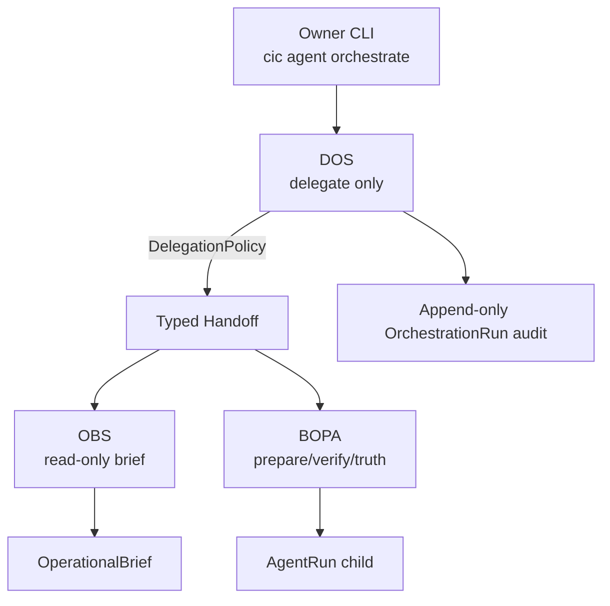
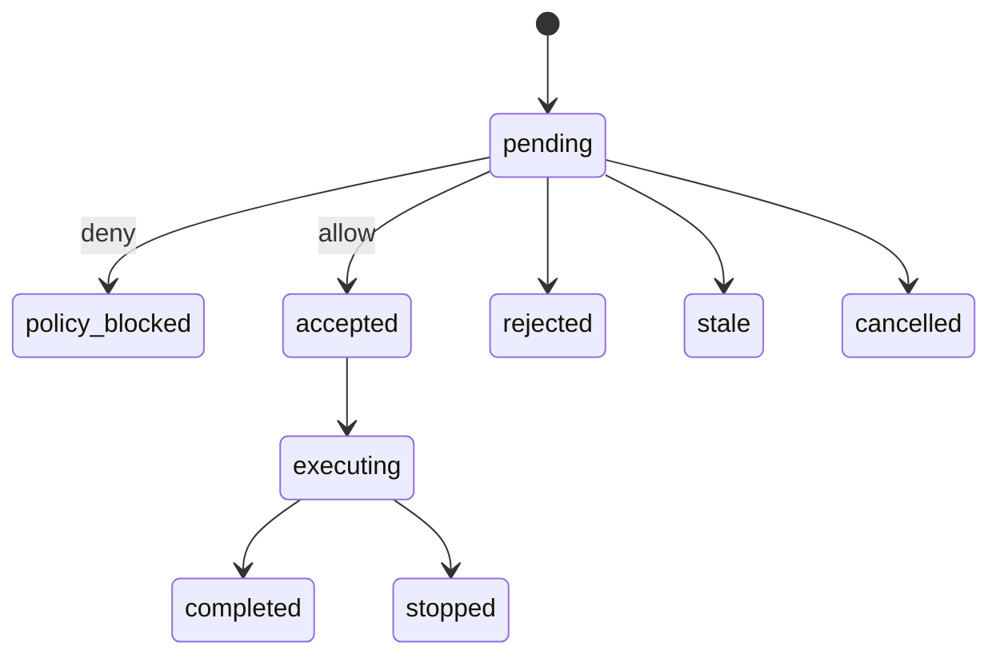
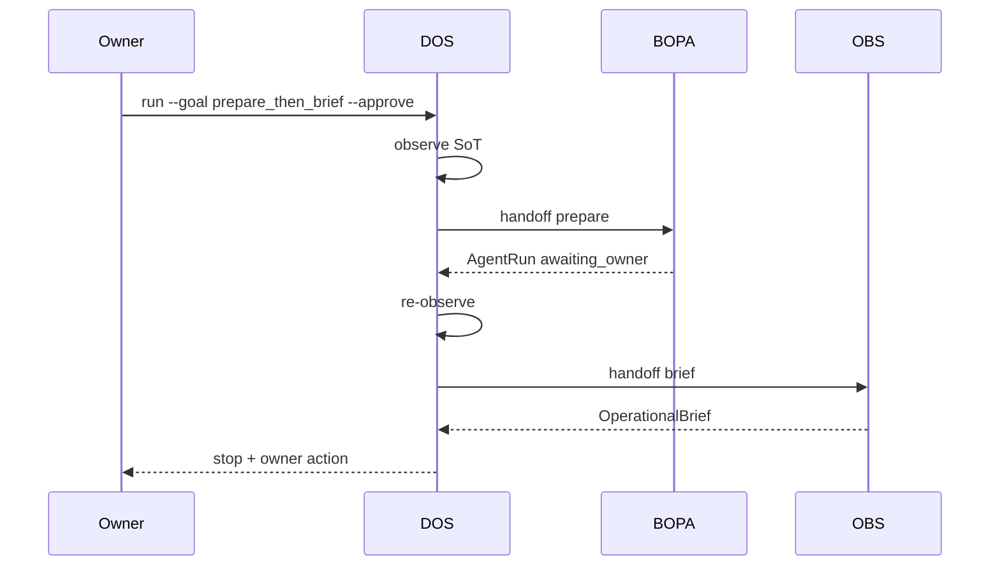
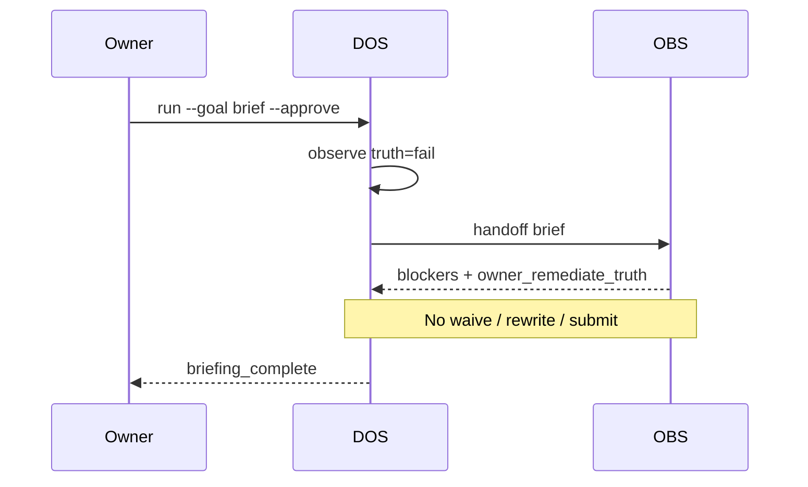

<!--
GENERATED MASTERCLASS SNAPSHOT — DO NOT EDIT BY HAND.
Authoritative source: docs/eval/fr016_multi_agent_orchestration.md
Mode: full-file snapshot
Regenerate: python scripts/build_masterclass_package.py <FR_ID>
Repository documentation remains the source of truth.
-->

# FR-016 — Multi-Agent Orchestration

**Status:** **Complete / Frozen / Accepted**  
**Date:** 2026-08-06  
**Documentation close-out:** 2026-08-06  
**Recommendation:** **ACCEPT AND FREEZE — LEARNING PROOF COMPLETE**  
**Binding product posture:** **GO AS LEARNING PROOF ONLY** (M2; unchanged through M4)  
**Engineering Learning Academy:** **Ready** — canonical engineering record =
this report; attachable package =
[masterclass/FR016/](../masterclass/FR016/) (`README.md`, `MANIFEST.md`, regenerable
`sources/`)  
**Next:** Horizon 1B (FR-018+) on owner request — **not gated on FR-017**.
**FR-017** is **complete and frozen**
([fr017_agent_evaluation_observability.md](fr017_agent_evaluation_observability.md)).
Ordinary prep remains `cic agent run`.

**ADR:** [ADR-008](../adr/008_multi_agent_orchestration.md) (Accepted — M1–M4 close-out)

**Milestones (historical records):**
[M0](fr016_m0_engineering_spike.md) (Accepted with revisions),
[M1](fr016_m1_orchestration_contracts.md),
[M2](fr016_m2_supervisor_runtime.md) (**GO AS LEARNING PROOF ONLY**),
[M3](fr016_m3_owner_cli.md),
[M4](fr016_m4_evaluation.md).

This document is the **canonical engineering record** for FR-016. Milestone reports
remain historical; do not reopen exit criteria without owner request.

---

## 1. Executive Summary

FR-016 delivers a **constrained multi-agent learning proof**:

| Role | Authority |
|------|-----------|
| **DOS** | Deterministic Orchestration Supervisor — **delegates only**; no domain work |
| **BOPA** | Frozen FR-015 preparation specialist — mutating allow-list **unchanged** |
| **OBS** | Read-only Operational Briefing Specialist — compose briefs; never mutate |

Typed handoffs, DelegationPolicy, per-specialist ToolPolicy, append-only parent/child
audit, checkpoint/resume, and loop controls are implemented and evaluated.

**Near-term product value is modest.** Direct `cic agent run` remains the preferred
daily preparation path. FR-016 is optional teaching/substrate tooling — not the
default workflow.

| Milestone | Delivered |
|-----------|-----------|
| M0 | Topology spike; Prep/Truth/Review theatre **rejected** |
| M1 | Contracts + ADR-008 |
| M2 | DOS + OBS + BOPA adapter; corpus; **GO AS LEARNING PROOF ONLY** |
| M3 | `cic agent orchestrate` owner CLI |
| M4 | Final corpus 20/20, safety/product review, study-aid source, docs freeze |

**Package:** `career_intelligence.multi_agent`  
**CLI:** `cic agent orchestrate {run,resume,show,history,list,check-delegation}`  
**Goals:** `brief` | `prepare` | `prepare_then_brief`

---

## 2. Business Problem

After FR-015, the owner can prepare a single Opportunity for review with BOPA.
Remaining questions were product and engineering honesty questions, not missing
prepare/truth tools:

1. When does a **second agent** add value beyond one bounded agent?
2. How do we teach **permission-separated multi-agent** design without shipping theatre?
3. How do we keep Horizon 1 job-acquisition first while capturing interview-transferable
   multi-agent engineering skill?

FR-016 exists to answer those questions with evidence — not to replace daily prep UX.

---

## 3. Engineering Problem

How can CIC introduce multi-agent orchestration that:

1. Separates supervisor authority from specialist authority?
2. Uses typed, auditable handoffs instead of free-form agent chat?
3. Keeps BOPA’s ToolPolicy and allow-list frozen?
4. Adds a second specialist only where the permission boundary is genuinely different?
5. Fails closed on loops, injection, truth waiver, submission, and pipeline mutation?
6. Remains evaluable offline without requiring an LLM supervisor?

The answer is **not** Prep/Truth/Review personas, and **not** an LLM coordinator with
shared tools. It is **DOS (delegate-only) + frozen BOPA + read-only OBS**.

---

## 4. Why FR-015 alone was insufficient (for this milestone)

FR-015 (BOPA) is sufficient — and preferred — for **ordinary preparation**.

FR-015 alone was insufficient for the **FR-016 learning objective** because:

- It does not demonstrate supervisor/specialist separation.
- It does not provide a second specialist with a **distinct** ToolPolicy.
- It does not exercise typed cross-specialist handoffs or parent/child audit.
- It does not teach why multi-agent theatre fails.

FR-016 therefore complements BOPA as substrate and curriculum; it does **not**
obsolete `cic agent run`.

---

## 5. Alternatives considered

| Alternative | Outcome |
|-------------|---------|
| Defer FR-016; keep BOPA only | Valid commercially; owner chose constrained learning path |
| Prep / Truth / Review specialist cast | **Rejected** — multi-agent theatre |
| Broaden BOPA to absorb briefing | **Rejected** — mixes brief-only with mutating prepare |
| LLM supervisor with chat handoffs | **Rejected** — weak control; injection surface |
| Hierarchical agent team | **Rejected** — unnecessary for single-user CIC |
| Framework graph (LangGraph / Agents SDK / CrewAI / MAF) | **Deferred / Out of Scope** — ADR-003 unmet |
| Productise as default daily workflow | **Rejected** — evidence showed modest value |

---

## 6. Rejected architectures (multi-agent theatre)

```text
Rejected:
  Supervisor
    ├── PrepAgent   → same prepare service
    ├── TruthAgent  → same truth service
    └── ReviewAgent → same owner-review stop
```

**Why rejected:** no distinct ToolPolicy; personas rename work already owned by
BOPA/services; weakens explainability; teaches the wrong interview lesson.

---

## 7. Final DOS / BOPA / OBS architecture

```
Owner: cic agent orchestrate run <opp> --goal <g> --approve
                    │
                    ▼
        ┌───────────────────────────────────────┐
        │ DeterministicOrchestrationSupervisor  │
        │ observe → select → DelegationPolicy   │
        │ → typed Handoff → specialist → audit  │
        │ NO domain services                    │
        └───────────────┬───────────────────────┘
                ┌───────┴────────┐
                ▼                ▼
           ObsRuntime      BopaSpecialistAdapter
           (read-only)     → AgentRuntime (FR-015)
                │                │
                ▼                ▼
        OperationalBrief     AgentRun (child)
```

Domain SoTs remain authoritative. Orchestration audit is additive recovery data.
Package is distinct from FR-008 `orchestration` and FR-015 `agent`.

---

## 8. ADR-008

[ADR-008](../adr/008_multi_agent_orchestration.md) freezes:

1. Constrained multi-agent under `career_intelligence.multi_agent`
2. Topology: DOS + BOPA + OBS + typed handoffs
3. DelegationPolicy admits specialists; per-specialist ToolPolicy admits actions
4. Deterministic default; optional LLM never expands allow-lists
5. Explicit theatre rejection (Prep/Truth/Review personas)
6. Commercial honesty: learning/substrate; no strong near-term product claim
7. Out of scope: discovery, submit, pipeline mutation, recruiter contact, truth waiver,
   free-form chat, frameworks without new ADR

---

## 9. Runtime behaviour

DOS loop: observe SoT → select specialist → evaluate DelegationPolicy → create typed
handoff → execute OBS or BOPA adapter → append audit → re-observe or stop.

| Goal | Typical path |
|------|----------------|
| `brief` | DOS → OBS → briefing_complete |
| `prepare` | DOS → BOPA → owner stop |
| `prepare_then_brief` | DOS → BOPA → OBS → owner stop |

Non-obvious routing: interviewing / ambiguity / truth blockers → OBS before (or
instead of) BOPA. Injection text in owner notes cannot alter delegation.

---

## 10. Authority boundaries

| Actor | May | Must not |
|-------|-----|----------|
| DOS | Observe, select, hand off, stop | Domain services, submit, pipeline, waive, inherit tools |
| BOPA | inspect, prepare, verify, validate truth, owner review, stop | submit, pipeline, discovery, waive, FR-008 repair |
| OBS | inspect readiness/pipeline/truth/history, compose brief, recommend | prepare, validate, submit, pipeline, waive |
| Handoff | Carry typed goal + hash + expected output | Grant tools or widen policy |

---

## 11. ToolPolicy separation

| Policy | Admits |
|--------|--------|
| **DelegationPolicy** | Whether DOS may invoke OBS or BOPA |
| **BOPA ToolPolicy** (`evaluate_action_policy`) | BOPA allow-listed actions only |
| **OBS ToolPolicy** (`evaluate_obs_action_policy`) | OBS read-only allow-list only |

Global orchestration limits (max steps, max visits, repeated/circular delegation,
no-progress) are separate from specialist ToolPolicies. No specialist inherits
another’s permissions.

---

## 12. Typed handoffs

Handoffs are append-only, policy-validated, and idempotent. Lifecycle:
`pending → policy_blocked | accepted → executing → completed | stopped`
(also rejected / stale / cancelled).

They carry: source, target, requested goal, observed state hash, expected output
kind, policy decision, child AgentRun or OperationalBrief ref. They never carry
free-form chat or tool grants.

---

## 13. Audit model

Parent `OrchestrationRun` under `data/orchestration_runs/` records events,
handoff IDs, specialist visits, child AgentRun IDs, last brief ID, stop reason,
and owner action. Child BOPA runs remain under `data/agent_runs/`. Audits are
**not** a second Opportunity SoT.

Owner presentation reconstructs: goal → observation → selection → policy →
handoff → authority → child → stop → next action (+ elapsed time).

---

## 14. Resume behaviour

Resume re-inspects authoritative state; rejects stale/contradictory checkpoints;
avoids repeating completed BOPA work; avoids regenerating unchanged OBS briefs;
requires `--approve`; preserves global and specialist limits.

---

## 15. Evaluation results

Final corpus `run_corpus()`: **20/20 PASS** ([M4](fr016_m4_evaluation.md)).

Covers brief, prepare, prepare_then_brief, interviewing, truth-blocked,
material-benefit, illegal delegation, OBS mutate, DOS domain-work, repeated/
circular delegation, stale checkpoint, partial BOPA resume, unchanged OBS resume,
provider outage, prompt injection, pipeline/submission/truth-waiver safety, and
step/visit limits.

---

## 16. Manual validation

Offline A–H journeys PASS via `scripts/run_fr016_m4_manual.py`.

**Live (safe):** brief-only on interviewing opportunity
`opp_01KY8RFAH81M9V30ZVH9TM09T5` → DOS → OBS → `briefing_complete`; pipeline note
that preparation is usually unnecessary; **no domain mutation**.

Mutating live prepare remains optional OAT outside freeze criteria.

---

## 17. Product-value assessment

| Question | Answer |
|----------|--------|
| Does DOS improve ordinary preparation? | **No** (materially) |
| Does OBS remove an interpretation task? | **Yes** (pipeline/truth briefs) |
| Does `prepare_then_brief` help? | Modest convenience |
| Permission separation worth complexity? | Yes for learning/substrate; not for daily prep |
| Ready as default daily workflow? | **No** — remain optional |

---

## 18. Learning-value assessment

**High.** FR-016 is justified primarily as:

- production practice of permission-separated multi-agent design;
- explicit rejection of multi-agent theatre;
- interview-transferable artefacts (authority matrix, handoff lifecycle, Q&A);
- substrate for a future specialist with a genuinely different boundary
  (e.g. Job Discovery).

---

## 19. Commercial assessment

Near-term commercial value: **modest**. Horizon 1 dual-value for daily applications
is better served by direct BOPA. Commercial upside rises if/when Job Discovery or
another second mutating authority appears — not by renaming BOPA roles.

Binding freeze posture: **GO AS LEARNING PROOF ONLY**.

---

## 20. Technical debt

| Item | Class |
|------|-------|
| Live LLM supervisor evaluation | Deferred → FR-017 / Future |
| Richer multi-specialist topology | Future FR |
| Scheduled briefings | Future FR / Out of Scope now |
| Job Discovery integration | Future FR |
| Orchestration replay / golden latency harness | Deferred → FR-017 |
| Richer observability (token/cost/provider aggregates) | Deferred → FR-017 |
| Framework migration | Out of Scope (ADR-003) |
| Visual study-aid / Masterclass generation | Deferred (source captured here) |
| Mutating live OAT dogfooding | Accepted (optional) |

No debt implemented during close-out.

---

## 21. Risks

| Risk | Mitigation / status |
|------|---------------------|
| Owners treat orchestrate as default prep | Banner + docs: prefer `cic agent run` |
| Theatre creep (new personas) | ADR-008 rejection; freeze |
| Privilege escalation via handoff | Typed handoff; no tool grants |
| Scope leak into FR-017 / 1B | Explicit “do not auto-start” |
| Overclaiming product value | Learning-proof verdict frozen |

---

## 22. Engineering retrospective

| Theme | Record |
|-------|--------|
| **What worked well** | Delegate-only DOS; OBS as distinct read-only boundary; typed handoffs; honest go/no-go; BOPA left frozen |
| **What did not** | Multi-agent did not beat direct BOPA on ordinary prep latency/complexity |
| **What surprised us** | OBS value on interviewing/truth briefs without needing a second mutating specialist |
| **What would be repeated** | Mandatory go/no-go before productisation; theatre rejection early; deterministic default |
| **What would be changed** | Would not market FR-016 as daily UX; would wait for Job Discovery before richer topology |
| **Why Learning Proof** | Evidence showed substrate + learning value > near-term product gain |
| **Why not preferred daily workflow** | Extra observe/handoff steps; owner interpretation cost; direct BOPA already sufficient |

---

## 23. Lessons learned (interview-ready)

1. **Authority boundaries** — supervisor ≠ specialist; specialist ≠ specialist.
2. **Deterministic orchestration** — routing and admission stay deterministic.
3. **Specialist permissions** — per-specialist ToolPolicy is mandatory.
4. **Theatre rejected** — same tools + new names ≠ multi-agent value.
5. **Typed handoffs matter** — audit, idempotency, fail-closed control.
6. **DOS performs no domain work** — prevents supervisor super-user escalation.
7. **OBS remains read-only** — briefing delta without widening BOPA.
8. **Direct BOPA preferred** for ordinary preparation.

---

## 24. Operational readiness

| Item | Status |
|------|--------|
| Learning-proof CLI operable | Yes (`cic agent orchestrate`) |
| Daily prep path | Prefer `cic agent run` |
| Safety gates | Pass (corpus + manual) |
| Live mutating dogfood | Optional OAT (not freeze blocker) |
| Default owner workflow | Remains direct BOPA |

---

## 25. Study-aid source material (no visuals generated)

### 25.1 Sixty-second explanation

Career Intelligence Copilot’s FR-016 is a learning proof of safe multi-agent
orchestration. A deterministic supervisor (DOS) never prepares packages or
submits applications — it only chooses specialists. BOPA remains the existing
bounded preparation agent. OBS is a read-only briefer for pipeline and truth
context. Typed handoffs and policies keep authorities separate. For everyday
prep, use `cic agent run`; use `cic agent orchestrate` to inspect and learn the
delegation story.

### 25.2 Five-minute lesson outline

1. Problem: when does multi-agent help vs theatre?  
2. Rejected design: Prep/Truth/Review personas.  
3. Accepted topology: DOS + BOPA + OBS.  
4. Authority matrix walkthrough.  
5. Happy path vs truth-blocked sequences.  
6. Why daily prep stays on direct BOPA.  
7. Interview Q&A from §25.12–25.13.

### 25.3 Final architecture (Mermaid)



### 25.4 Direct BOPA vs DOS+BOPA+OBS

```text
Direct:   Owner → BOPA → services → stop
Multi:    Owner → DOS → (OBS | BOPA) → stop
Prefer:   Direct for ordinary prep
Use multi: learning, briefing, future specialists
```

### 25.5 Authority matrix

See §10.

### 25.6 Typed handoff lifecycle



### 25.7 Happy-path sequence (`prepare_then_brief`)



### 25.8 Truth-blocked sequence



### 25.9 Rejected multi-agent theatre

See §6.

### 25.10 Major trade-offs

| Trade-off | Choice |
|-----------|--------|
| Product value vs learning | Learning proof only |
| Supervisor power | Delegate-only DOS |
| Chat vs typed handoffs | Typed + audited |
| LLM vs deterministic | Deterministic default |
| Broaden BOPA vs OBS | OBS for brief-only delta |
| Framework now | Custom contracts (ADR-003) |

### 25.11 Five key lessons

1. Distinct permissions justify agents; renamed roles do not.  
2. Supervisors must not become domain super-users.  
3. Typed handoffs enable audit and fail-closed control.  
4. Deterministic policy remains the admission authority.  
5. Architecture success ≠ product default.

### 25.12 Ten interview questions

1. Why reject Prep/Truth/Review agent splitting?  
2. What can DOS never do, and why?  
3. How do DelegationPolicy and ToolPolicy differ?  
4. How does a typed handoff prevent privilege escalation?  
5. When should OBS run instead of BOPA?  
6. How do you prevent circular specialist loops?  
7. How does resume avoid duplicate preparation?  
8. Why keep deterministic routing as default?  
9. When would multi-agent become commercially stronger?  
10. How do you explain FR-016 without overselling product value?

### 25.13 Concise model-answer points

1. Theatre = same tools, new names; need distinct allow-lists.  
2. DOS: observe/select/hand off only — no prepare/submit.  
3. Delegation admits specialists; ToolPolicy admits actions.  
4. Handoff carries goal/hash/output kind — not tool grants.  
5. Interviewing/truth/brief goals → OBS first.  
6. Max steps, visit limits, repeated/circular denies.  
7. Re-observe SoT; skip completed child / unchanged brief.  
8. LLM never expands allow-lists; policy is sole admission.  
9. Job Discovery / second mutating authority boundary.  
10. Learning proof + substrate; prefer `cic agent run` daily.

### 25.14 Glossary

| Term | Meaning in FR-016 |
|------|-------------------|
| Supervisor | DOS — deterministic coordinator that only delegates |
| Specialist | BOPA or OBS with its own ToolPolicy |
| Delegation | Admission of a specialist invocation by DelegationPolicy |
| Handoff | Typed, append-only request from supervisor to specialist |
| ToolPolicy | Per-specialist admission of actions |
| Authority boundary | What a specialist may / must not do |
| Source of truth | Opportunity / package / truth / pipeline domain records |
| Checkpoint | Recovery pointer on OrchestrationRun (not SoT) |
| Orchestration audit | Append-only parent events + handoffs + child refs |
| Privilege escalation | Gaining another specialist’s tools via handoff or role |

---

## 26. Tests

| Suite | Result |
|-------|--------|
| `tests/unit/multi_agent/` (incl. 20-case corpus) | PASS |
| `tests/unit/agent/test_cli.py` | PASS |
| `scripts/run_fr016_m4_manual.py` | PASS |
| Live interviewing brief | PASS (OBS only) |

---

## 27. Definition of Done

| Criterion | Status |
|-----------|--------|
| M0 architecture accepted | Done |
| ADR-008 accepted | Done |
| M1–M4 delivered | Done |
| DOS / BOPA adapter / OBS | Done |
| Delegation + ToolPolicy separation | Done |
| Typed handoffs + audit + resume | Done |
| Owner CLI | Done |
| Corpus 20/20 + manual validation | Done |
| Honest product / learning / commercial assessment | Done |
| Study-aid source captured | Done |
| Documentation frozen + navigation consistent | Done |
| No FR-017 implementation | Confirmed |
| No scope leakage | Confirmed |
| Engineering Learning Academy ready | Confirmed |

---

## 28. Acceptance recommendation

**ACCEPT AND FREEZE — LEARNING PROOF COMPLETE**

---

## 29. Final repository status

| Item | Status |
|------|--------|
| FR-016 | **Complete / Frozen / Accepted** |
| Learning Proof | Complete |
| Engineering Learning Academy | **Ready** |
| M2 verdict | **GO AS LEARNING PROOF ONLY** (preserved) |
| Daily prep | **`cic agent run`** |
| Orchestration CLI | Optional learning/substrate |
| FR-017 | **Complete / Frozen** ([fr017_agent_evaluation_observability.md](fr017_agent_evaluation_observability.md)) |
| Horizon 1B | **Not blocked** on FR-017; start on owner request (usable 1A application loop) |
